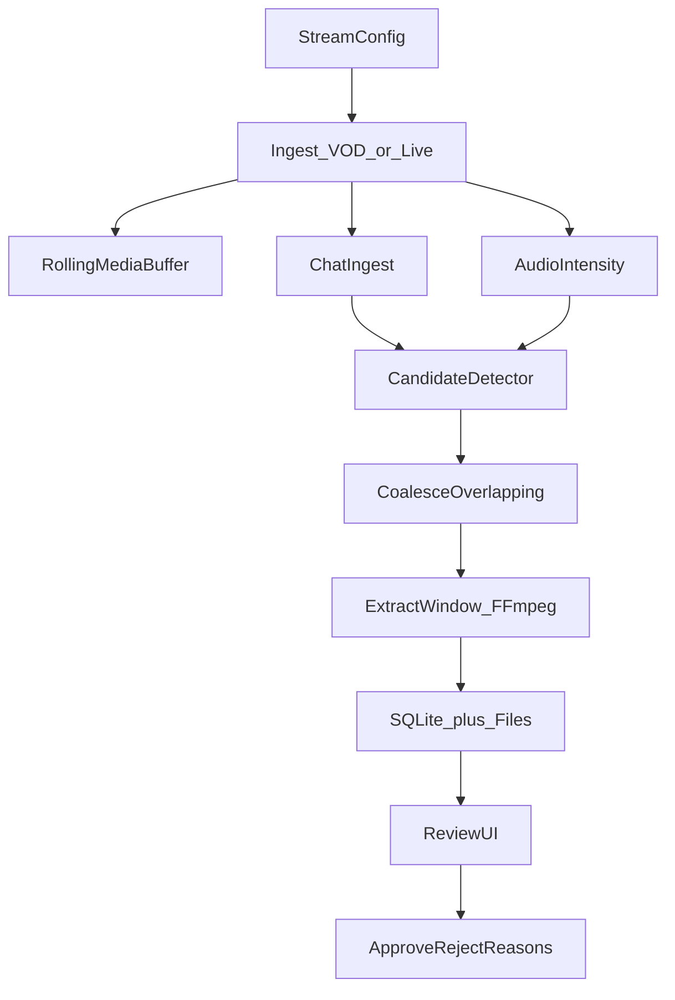

# Clippy MVP Implementation Plan

## Goal

Ship the smallest system that answers: **Can we consistently find moments a human would clip?**

No publishing, no autonomous mode, no learning ranker. One stream. Human review only.

## Defaults (locked for this plan)

- **Stack:** Python, FFmpeg, local filesystem media, SQLite, FastAPI + simple HTML review UI
- **Validation path:** VOD/replay first, then live Twitch
- **Signals in MVP:** chat rate/keywords + audio intensity only
- **AI:** optional candidate-only enrichment later; not required to call Phase 1 done

## Out of scope

- TikTok / YouTube / Instagram publishing
- Continuous ASR, vision/scene-change, streamer face-emotion CV
- Redis/Celery/S3/multi-stream
- Captioning, vertical crop, auto-edit polish
- Learned ranking from performance metrics

## Architecture



## Repo layout

```text
clippy/
  pyproject.toml / requirements.txt
  README.md
  src/clippy/
    config.py
    ingest/          # VOD + live adapters
    buffer/          # rolling media segments
    chat/            # IRC/EventSub or VOD chat dump
    audio/           # RMS/peak intensity features
    detect/          # anomaly + keyword rules + coalesce
    extract/         # FFmpeg window cut
    store/           # SQLite models + repos
    api/             # FastAPI routes
    ui/              # review templates/static
  data/              # local DB + media (gitignored)
  scripts/           # run_vod.py, run_live.py
```

## Data model (SQLite)

- `streamers` — id, login, display_name
- `streams` — id, streamer_id, mode (`vod`|`live`), source_url/vod_id, started_at
- `candidates` — stream_id, source_ts, pre/post seconds, signals JSON, score, media_path, status (`pending`|`approved`|`rejected`)
- `reviews` — candidate_id, decision, reason_code, notes, reviewed_at

**Rejection reasons:** `false_alarm`, `needs_context`, `too_long`, `boring`, `unsafe`, `other`

## Build sequence

### Milestone 0 — Project skeleton

- Python package, deps (fastapi, uvicorn, sqlite, pydantic, numpy/librosa or lightweight RMS via ffmpeg, httpx)
- Config via `.env` / yaml (Twitch client id/secret later; paths; window sizes; thresholds)
- Gitignore for `data/`, secrets

### Milestone 1 — Config

- Stream config: window 30s pre/post, coalesce gap (e.g. 20s), intensity threshold, chat spike multiplier
- Paths for media/DB; disk budget setting

### Milestone 2 — VOD ingest path (primary)

- Download/process one Twitch VOD (or local mp4 + chat JSON for fully offline)
- Align chat timestamps to media timeline (document the clock: VOD-relative seconds)
- Write segmented media to rolling/local buffer directory

### Milestone 3 — Signals + detector

- **Chat:** messages/sec over sliding window vs baseline; keyword/phrase hits (`clip`, `CLIP IT`, etc.)
- **Audio:** short-frame RMS/peak; spike vs rolling baseline
- Combine into candidate score; **coalesce** overlapping detections into one candidate
- Persist candidate row with signal payload

### Milestone 4 — Window extraction

- On candidate: FFmpeg cut `[t-pre, t+post]` to `data/media/{candidate_id}.mp4`
- Store path + score; skip extract if disk budget exceeded (simple max GB config)

### Milestone 5 — Review UI

- List pending candidates ranked by score
- Play video, show timestamp, signals summary, transcript placeholder (empty for now)
- Approve / Reject + reason
- Basic stats: approve rate, count by reason (enough to judge MVP success)

### Milestone 6 — Live Twitch (secondary)

- HLS (or Streamlink) video + Twitch chat (IRC/EventSub)
- Same detector/extract/review pipeline
- Handle reconnect; keep buffer bounded

### Milestone 7 — Eval harness (lightweight)

- Export reviews CSV/JSON
- Report precision = approved / reviewed over a run
- Optional weak-label note: count chat “CLIP IT” peaks that produced a candidate (proxy recall)

## Success criteria

MVP is done when, on ≥1 IRL VOD (then optionally a live session):

1. System produces a ranked candidate feed with playable windows
2. Human can approve/reject with reasons
3. **Approve rate is measurable** (target to tune toward, not a hard ship gate: e.g. aim for ≥30–40% after threshold tuning)
4. Overlapping spikes collapse to one candidate per moment

## Key implementation notes

- **Timeline:** store all events as seconds relative to stream start; never mix wall-clock and PTS without an offset
- **Cost:** no cloud AI required for MVP done; if added later, hard cap calls/hour
- **Interesting vs clippable:** score is “detection confidence” only; humans judge clippability via labels
- **Twitch Clip API:** not used in MVP (local cut from media); revisit at publish phase
