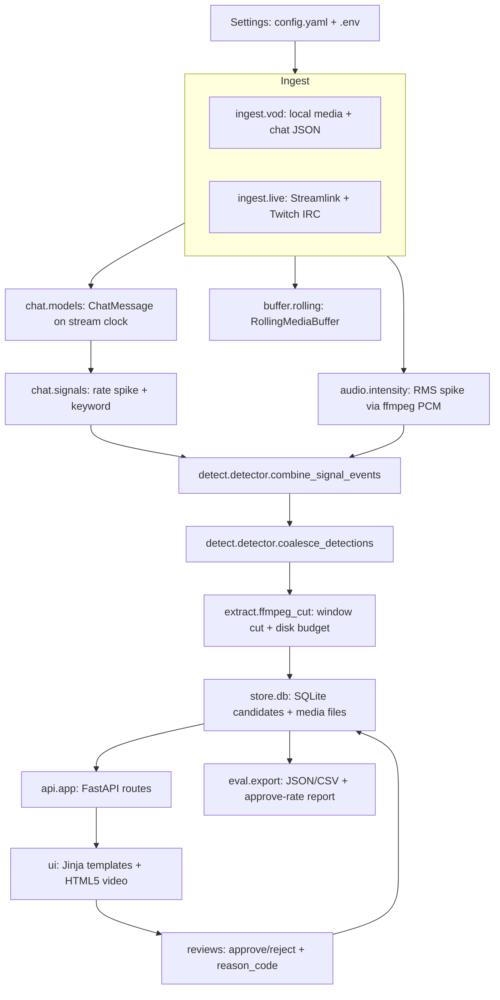
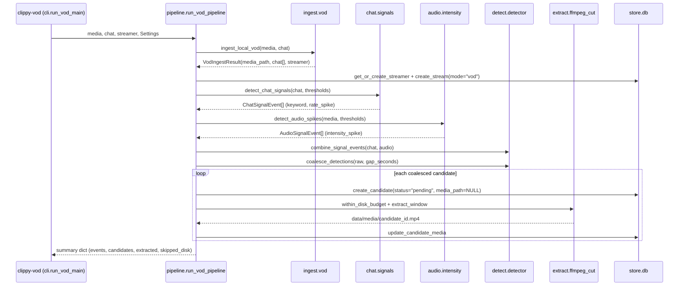
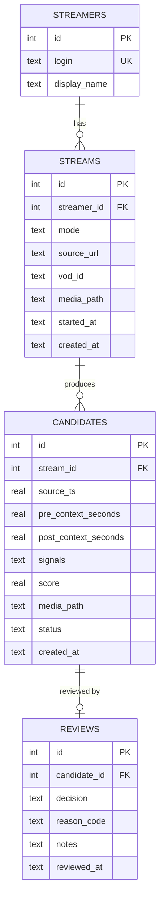
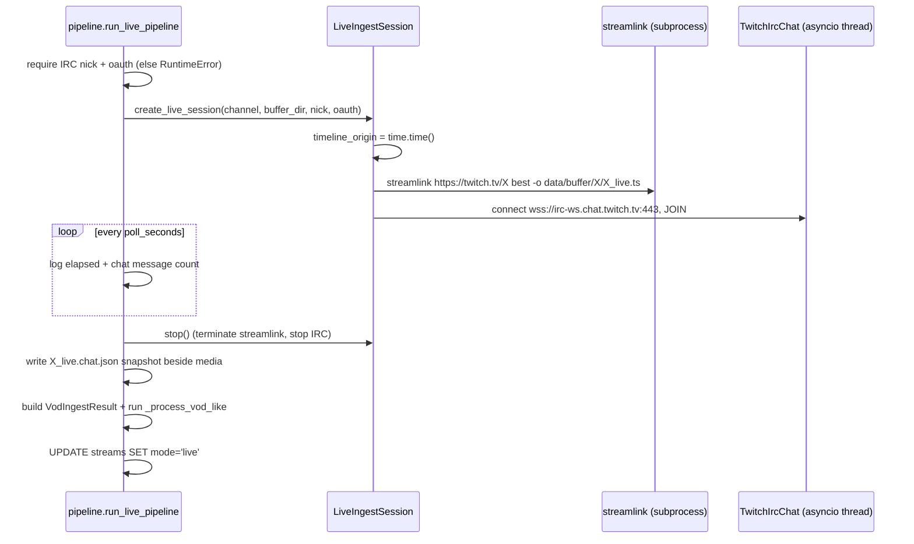

# Clippy — System Architecture

Clippy is a **candidate-detection pipeline with a human review loop**. It watches one Twitch
source at a time (VOD/local media first, live second), flags moments that look interesting
from chat and audio signals, cuts those moments into short playable windows, and records a
human approve/reject decision for each one.

It deliberately does **not** publish, edit, rank with a learned model, or make autonomous
clipping decisions. The only question it answers is: *can we consistently surface moments a
human would clip?* The measurable answer is the **approve rate** over reviewed candidates.

---

## 1. Scope and boundaries

| In scope (Phase 1)                                          | Out of scope (by design)                                     |
| ----------------------------------------------------------- | ------------------------------------------------------------ |
| One Twitch source per run (local VOD file or live capture)   | Multi-stream concurrency, Redis/Celery/S3                    |
| Chat rate/keyword signals + audio intensity spikes           | ASR/transcripts, vision, scene change, face/emotion CV       |
| Overlap coalescing into one candidate per moment             | Learned ranker from performance metrics                      |
| FFmpeg window extraction to local MP4 files                  | Vertical crop, captioning, auto-edit polish                  |
| SQLite persistence of streams, candidates, reviews           | TikTok / YouTube / Instagram publishing                      |
| FastAPI + Jinja review UI, approve/reject with reason codes  | Twitch Clip API usage (clips are cut locally from media)     |
| Review export (JSON/CSV) + approve-rate report               | Cloud AI (optional later, hard-capped calls/hour)            |

The design principle behind every shortcut: **score is detection confidence, not
clippability**. Humans decide clippability. Any part of the system that would need to
understand *why* a moment is good is intentionally left to the reviewer.

---

## 2. System at a glance



Everything downstream of ingest is shared. The VOD path and the live path produce the same
`VodIngestResult`-shaped object (a media file, chat messages on a stream-relative clock, and
streamer identity), so detection, extraction, storage, review, and export never branch on
mode. Only the ingest adapter and one `streams.mode` column differ.

### VOD run sequence (primary path)



`clippy-serve` then opens the review UI against the same SQLite file, and `clippy-export`
produces the eval artifacts. The commands are independent processes sharing only `data/`.

---

## 3. Runtime surfaces

### Entry points (`pyproject.toml` → `src/clippy/cli.py`)

| Command          | Function                     | What it does                                                                 |
| ---------------- | ---------------------------- | ---------------------------------------------------------------------------- |
| `clippy-vod`     | `cli.run_vod_main`           | VOD/local media + chat JSON → detect → extract → persist; prints summary JSON |
| `clippy-live`    | `cli.run_live_main`          | Records live via Streamlink + IRC for `--duration`, then runs the same batch path |
| `clippy-serve`   | `cli.serve_main`             | `uvicorn.run(create_app(settings), host, port)`                              |
| `clippy-export`  | `cli.export_main`            | Writes `data/exports/reviews.json` + `reviews.csv`, prints the stats report    |

`scripts/*.py` are one-line wrappers around the same functions for people who prefer
`python scripts/run_vod.py ...`. All commands accept `--config <path>` and call
`get_settings.cache_clear()` before loading, so a per-run config file is honoured.

### HTTP surface (`src/clippy/api/app.py`)

| Route                                | Purpose                                                      |
| ------------------------------------ | ------------------------------------------------------------ |
| `GET /`                               | Candidate grid, ranked by score; `?status=pending\|approved\|rejected\|all` |
| `GET /candidates/{id}`                | Detail page: video, raw signals JSON, transcript placeholder, review form |
| `POST /candidates/{id}/review`        | Form post with `decision`, `reason_code`, `notes`; 303 redirect back to `/` |
| `GET /media/{id}`                     | Streams the extracted MP4 from `candidates.media_path`        |
| `GET /api/stats`                      | JSON stats (same payload as the eval report)                  |
| `/static/*`                           | Mounted `ui/static` (CSS)                                     |

`create_app()` constructs `Settings`, ensures data directories exist, and opens the
`Database` once at startup, storing both on `app.state`.

---

## 4. Module map

| Path                              | Responsibility                                                                                  |
| --------------------------------- | ----------------------------------------------------------------------------------------------- |
| `src/clippy/config.py`            | `Settings` (pydantic-settings), YAML override loading, path resolution, `ensure_dirs()`          |
| `src/clippy/pipeline.py`          | Orchestration: `run_vod_pipeline`, `_process_vod_like`, `run_live_pipeline`                      |
| `src/clippy/cli.py`               | Argparse entry points + logging config                                                           |
| `src/clippy/ingest/vod.py`        | Offline ingest: validates paths, loads chat, returns `VodIngestResult`                           |
| `src/clippy/ingest/live.py`       | `LiveIngestSession`: Streamlink subprocess + IRC thread, chat buffering, stop/cleanup             |
| `src/clippy/buffer/rolling.py`    | `RollingMediaBuffer`: segment storage with age-based pruning for bounded live retention           |
| `src/clippy/chat/models.py`       | `ChatMessage` + tolerant `load_chat_json` (multiple schema shapes)                                |
| `src/clippy/chat/signals.py`      | `detect_chat_signals`: keyword hits + sliding-window rate spikes, near-duplicate suppression      |
| `src/clippy/chat/irc.py`          | Minimal Twitch IRC-over-WebSocket client (tags, PING/PONG, auto-reconnect, stream-clock ts)       |
| `src/clippy/audio/intensity.py`   | ffmpeg → mono PCM decode, `compute_rms_series`, `detect_audio_spikes`, `probe_duration_seconds`   |
| `src/clippy/detect/detector.py`   | `RawDetection` / `CoalescedCandidate`, `combine_signal_events`, `coalesce_detections`             |
| `src/clippy/extract/ffmpeg_cut.py`| `extract_window` (re-encode cut), `media_dir_size_bytes`, `within_disk_budget`                     |
| `src/clippy/store/db.py`          | SQLite schema, dataclasses, `Database` repository methods, `REJECTION_REASONS`                     |
| `src/clippy/eval/export.py`       | `export_reviews_json/_csv`, `precision_report`                                                     |
| `src/clippy/api/app.py`           | FastAPI app factory, routes, Jinja2 templates, static mount                                        |
| `src/clippy/ui/`                  | `templates/base.html`, `index.html`, `candidate.html`; `static/style.css`                          |
| `tests/test_core.py`              | Chat loading, chat signal detection, coalescing, chat+audio boosting, DB review round-trip         |

Dependency direction is strictly one-way: `cli → pipeline → {ingest, chat, audio, buffer,
detect, extract, store}` and `api → {store, config}`. `eval` depends only on `store`. There
are no web or media dependencies inside `detect`/`chat`/`audio`, which is what keeps the
signal logic unit-testable without ffmpeg or network access.

---

## 5. Timeline and clock contract

All times in the system are **seconds relative to stream start**, called `ts` or
`source_ts`. This single contract is what makes the pipeline composable.

- **VOD:** `t=0` is the start of the local media file. Chat JSON must already be on that
  clock via `ts`, `offset_seconds`, `content_offset_seconds`, or `contentOffsetSeconds`
  (see `chat/models._parse_message`). ffmpeg seek positions are applied to the same file, so
  detection time == extraction offset with no offset arithmetic.
- **Live:** `LiveIngestSession.timeline_origin = time.time()` is set at `start()`. Streamlink
  begins writing the media file at that instant and `TwitchIrcChat` stamps every message as
  `time.time() - timeline_origin`. Recorded file PTS and chat `ts` therefore share origin 0.
- **Never** mix wall-clock and media PTS without an explicit origin offset — this is the most
  failure-prone area of the system, so both live chat and live media derive from the single
  `timeline_origin` value.

Chat messages are sorted by `ts` on load, which the two-pointer scanners in
`chat/signals.py` rely on.

---

## 6. Signal detection

Detection is a two-stage pipeline: **per-modality event extraction** followed by
**combination and coalescing**. Each stage is a pure function of its inputs plus thresholds,
so it can be reasoned about and tested independently.

### 6.1 Chat signals (`chat/signals.py` → `ChatSignalEvent`)

Two independent detectors run over the same message list:

1. **Keyword hits** — substring match (case-insensitive) against `chat_keywords`. The default
   list (`clip it`, `clip that`, `clip this`, `clip`) is checked in order, so the specific
   phrases win over the generic `clip`. Each hit emits an event at the message `ts` with
   `score = chat_keyword_score` (0.7) and details `{keyword, user, text}`.
2. **Rate spikes** — a two-pointer sliding window evaluated at each message timestamp:
   - `window_rate = messages in the last chat_window_seconds / chat_window_seconds`
   - `baseline_rate = messages in the last chat_baseline_seconds / chat_baseline_seconds`
   - Emitted only when `window_rate >= chat_min_rate`, `baseline_rate > 0`, and
     `window_rate >= baseline_rate * chat_spike_multiplier` (3.0× by default).
   - Events closer together than `chat_window_seconds` are suppressed so one burst cannot
     produce a dense cluster of spikes.
   - Score is fixed at `chat_spike_score` (0.85); details carry `window_rate`,
     `baseline_rate`, the ratio, and `window_count`.

Both detectors finish with `_dedupe_nearby(gap=1.0)`, which keeps the higher-scoring event
when two events of the *same kind* land within a second of each other.

*Design note:* rates are computed over **message counts in a time window**, not over
fixed-size zero-filled buckets, so long quiet stretches are represented by a low baseline
rather than a bucket full of zeros. That makes the multiplier sensitive in quiet IRL chat,
which is exactly where `CLIP IT` bursts matter — and it is also the knob most likely to need
tuning per channel (`chat_spike_multiplier`, `chat_min_rate`).

### 6.2 Audio signals (`audio/intensity.py` → `AudioSignalEvent`)

1. `extract_mono_pcm` decodes the whole media file to mono 16 kHz float32 little-endian PCM
   through an ffmpeg stdout pipe (`-ac 1 -ar 16000 -f f32le pipe:1`).
2. `compute_rms_series` reshapes samples into `audio_frame_seconds` (0.5 s) frames and takes
   per-frame RMS, with each frame timestamped at its midpoint `(i + 0.5) * frame_seconds`.
3. `detect_audio_spikes` walks the series and computes a local baseline as the mean RMS of
   the preceding `audio_baseline_seconds` (30 s) of frames. An event is emitted when the frame
   passes an **absolute floor** (`rms >= audio_min_rms`, 0.02) *and* a **relative spike**
   (`rms >= baseline * audio_spike_multiplier`, 2.5×), with a `2 * frame_seconds` refractory
   period between emissions. Details carry `rms`, `baseline_rms`, and `multiplier`; score is
   `audio_spike_score` (0.75).

The absolute floor exists so near-silence frames cannot produce spikes from tiny baselines;
the relative term is what actually signals a shout, laugh, or loud reaction.

### 6.3 Combination (`detect/detector.combine_signal_events`)

Chat and audio events are fused into `RawDetection` rows:

- For each chat event, the **nearest unused audio event within 5 seconds** is consumed. The
  fused detection is tagged `kind="chat_audio"`, keeps the chat timestamp, and scores
  `min(1.0, chat.score + 0.5 * audio.score)` — i.e. a chat spike plus a nearby loud moment
  outranks either alone, which is the strongest signal in the MVP.
- Chat events with no audio partner become `kind=<chat kind>` detections at their own score.
- Audio events that were never consumed become their own detections, so a loud moment with no
  chat reaction is still surfaced for review.
- Output is sorted by `ts`.

### 6.4 Coalescing and scoring (`detect/detector.coalesce_detections`)

Raw detections are sorted and clustered: a detection joins the current cluster when it is
within `coalesce_gap_seconds` (20 s) of the previous detection. Each cluster becomes exactly
**one** `CoalescedCandidate`, satisfying the success criterion "overlapping spikes collapse to
one candidate per moment":

- `ts` = timestamp of the highest-scoring detection in the cluster (the peak), not the mean.
- `score` = that peak score (cluster max).
- `signals` = `{events: [...], event_count: N, kinds: [...]}` plus the peak event's own fields
  at the top level, so the review UI can show both the summary and the primary signal.

There is intentionally **no learned ranking** and no cross-modality normalization beyond the
above; the score ordering only has to be good enough to sort the review queue.

---

## 7. Window extraction and disk budget (`extract/ffmpeg_cut.py`)

For each coalesced candidate the pipeline computes the clip window from config, not from the
signal:

```text
start    = max(0.0, source_ts - pre_context_seconds)
duration = pre_context_seconds + post_context_seconds     # 60 s by default
output   = data/media/candidate_{candidate_id}.mp4
```

- Extraction is a **re-encode** (`-c:v libx264 -preset veryfast -crf 23 -c:a aac
  -movflags +faststart`). This costs CPU but was chosen deliberately: stream-copy cuts on
  Twitch VODs can drift or start on a keyframe far from the requested `-ss`, which would break
  the "the moment sits inside the clip" contract reviewers rely on.
- The candidate row is inserted **first** (`media_path=NULL`), then media is attached with
  `update_candidate_media`. If ffmpeg fails, the exception is logged and the candidate remains
  in the review queue with no playable media (`No media extracted` in the UI) instead of
  disappearing.
- `within_disk_budget(media_dir, disk_budget_gb)` sums the byte size of everything under
  `data/media` and compares against `disk_budget_gb` (20 GB default). The check runs before
  every extract; once the budget is hit, **all remaining candidates are still persisted**
  without media and counted in `skipped_disk` in the run summary. Nothing silently vanishes.

---

## 8. Storage layer (`store/db.py`)

SQLite, one file (`data/clippy.db`), no ORM. `Database` opens a short-lived connection per
operation through a `connection()` context manager (`PRAGMA foreign_keys = ON`, commit on
success, rollback on error), and the schema is created idempotently on construction, so no
migration tooling is needed for a single-writer local tool.



`mode` is constrained to `vod|live`, `status` to `pending|approved|rejected`, and `decision`
to `approved|rejected`. Indexes: `idx_candidates_stream_score(stream_id, score DESC)` and
`idx_candidates_status(status)` — the review queue is always "pending, highest score first",
which these cover.

**Invariants and conventions**

- `signals` is JSON text; the repository serializes on write and deserializes into `dict` on
  read, so callers always see Python structures (`Candidate.signals`).
- `reviews.candidate_id` is `UNIQUE`, and `review_candidate()` upserts (insert or update) and
  then writes back `candidates.status = decision`. Reviewing is therefore idempotent and
  re-reviewable; `candidates.status` is a denormalized copy that exists purely to make the
  queue query fast and to keep the schema self-describing.
- Queue ordering is `ORDER BY c.score DESC, c.source_ts ASC`, deterministic for equal scores.
- `reason_code` is validated against `REJECTION_REASONS = (false_alarm, needs_context,
  too_long, boring, unsafe, other)` and is only meaningful for rejections (the API clears it
  on approve).
- Dataclasses (`Streamer`, `Stream`, `Candidate`, `Review`, `CandidateView`) are the only
  objects crossing the storage boundary; `CandidateView` joins candidate + review + streamer +
  stream mode so templates never issue queries.
- Timestamps are ISO-8601 UTC strings (`utc_now()`). They are audit metadata only and are never
  used for signal math, which uses stream-relative seconds exclusively.

---

## 9. Review loop (`api/app.py` + `ui/`)

The review step is what turns detections into labels, and it is intentionally the simplest
possible surface — HTML pages, HTML5 video, one form, no JavaScript.

1. `GET /` renders `index.html`: a card grid of candidates (pending by default) with an inline
   `<video>` served from `/media/{id}`, plus score, `source_ts`, stream mode, status, and the
   signal `kind`/`kinds` summary. A `status` query parameter switches to
   `pending|approved|rejected|all`.
2. `GET /candidates/{id}` renders `candidate.html`: full video, pretty-printed signals JSON,
   a **transcript placeholder** (explicitly marked "ASR not in MVP"), and the review forms.
3. `POST /candidates/{id}/review` accepts `decision`, `reason_code`, `notes`; validates the
   decision; drops `reason_code` on approvals; calls `db.review_candidate(...)`; and 303
   redirects to `/` so a refresh cannot resubmit.
4. Both pages display `db.stats()` — pending/approved/rejected counts, approve rate, and the
   rejection-reason breakdown — so a reviewer can watch the MVP metric move while labelling.
5. `GET /api/stats` exposes the same numbers as JSON for scripting.

Because labelling happens against the *detected* set, approve rate is a direct precision proxy
for the detector as configured: `approve_rate = approved / (approved + rejected)`. It is the
number that threshold tuning (`coalesce_gap_seconds`, spike multipliers, `chat_min_rate`) is
meant to move.

---

## 10. Eval harness (`eval/export.py`)

- `export_reviews_json` / `export_reviews_csv` write `data/exports/reviews.json` and
  `reviews.csv` from a single join across `reviews → candidates → streams → streamers`,
  flattening each row and decoding `signals` back into structured JSON. The CSV has an explicit
  `fieldnames` list and ignores extras, so the export schema is stable for downstream analysis.
- `precision_report` returns `db.stats()` plus `clip_keyword_candidates` — a count of
  candidates whose signal blob mentions the `clip` keyword. This is the plan's lightweight
  **weak-label proxy recall check**: if chat screamed `CLIP IT` and no candidate was produced,
  recall is failing even when precision looks fine.
- `clippy-export` prints the report and writes both files. There is no automated ground-truth
  comparison by design — human labels *are* the ground truth at this stage.

---

## 11. Live path (`ingest/live.py` + `chat/irc.py`, secondary)

`clippy-live --channel X --duration N` reuses the entire batch pipeline; only the ingest
adapter changes.



- **Recording:** streamlink writes one continuously growing `.ts` into
  `data/buffer/{channel}/`; ads are disabled (`--twitch-disable-ads`) and stream retries are
  configured (`--retry-streams 5 --retry-max 10`). Missing streamlink, or a zero-byte output,
  raises a clear `RuntimeError`.
- **Chat:** a daemon thread runs its own asyncio loop hosting the IRC client; messages are
  appended to an in-memory list through the `on_message` callback. The IRC client requests
  `twitch.tv/tags twitch.tv/commands`, answers `PING` with `PONG`, reconnects after 3 s on any
  exception, and strips an optional `oauth:` prefix from the token.
- **Detection timing:** detection runs **after** the recording window closes, not continuously.
  This is the deliberate MVP simplification — it removes the need for a rolling segment index
  and a streaming detector, and the same thresholds then apply identically to VODs and live
  captures.
- **Chat snapshot:** `X_live.chat.json` is written next to the media for reproducibility, so a
  live session can be re-analysed offline or after threshold changes.
- **`RollingMediaBuffer`** is wired into the session (`set_source_media`) and provides
  `add_segment` / `prune` for age-bounded retention, but because detection is post-hoc and
  streamlink already writes a single file, no pruning is currently triggered on the live path —
  it is the designed seam for a future true streaming detector.

---

## 12. Configuration reference

Layered as: **`config.yaml` (init kwargs) → `CLIPPY_*` env vars → `.env` file → field
defaults**. YAML takes precedence over environment variables here because YAML is passed as
pydantic-settings *init* arguments, which rank highest in the source priority order — the
comment in `config.example.yaml` claiming env vars override YAML is inaccurate. Verified:
`CLIPPY_PORT=9999` with `port: 8000` in `config.yaml` resolves to `8000`. `get_settings()` is
`lru_cache`d, and every CLI entry point calls `get_settings.cache_clear()` so `--config` works.

| Key                            | Default                                    | Effect                                              |
| ------------------------------ | ------------------------------------------ | --------------------------------------------------- |
| `data_dir`                     | `<project>/data`                           | Root for DB, media, buffer                          |
| `db_path` / `media_dir` / `buffer_dir` | `data/clippy.db`, `data/media`, `data/buffer` | Overridable individually                  |
| `pre_context_seconds`          | `30.0`                                     | Seconds kept before the candidate timestamp         |
| `post_context_seconds`         | `30.0`                                     | Seconds kept after the candidate timestamp          |
| `coalesce_gap_seconds`         | `20.0`                                     | Max gap between detections merged into one candidate |
| `chat_window_seconds`          | `5.0`                                      | Sliding window for chat rate                        |
| `chat_baseline_seconds`        | `60.0`                                     | Baseline window for chat rate                       |
| `chat_spike_multiplier`        | `3.0`                                      | Window rate must be this multiple of baseline       |
| `chat_min_rate`                | `0.5`                                      | Absolute floor for window rate (messages/s)         |
| `chat_keywords`                | `clip it`, `clip that`, `clip this`, `clip`| Substring keyword triggers                          |
| `chat_keyword_score`           | `0.7`                                      | Score for keyword events                            |
| `chat_spike_score`             | `0.85`                                     | Score for rate-spike events                         |
| `audio_frame_seconds`          | `0.5`                                      | RMS frame size                                      |
| `audio_baseline_seconds`       | `30.0`                                     | Rolling baseline for audio                          |
| `audio_spike_multiplier`       | `2.5`                                      | Frame RMS must be this multiple of baseline         |
| `audio_min_rms`                | `0.02`                                     | Absolute floor so near-silence cannot spike         |
| `audio_spike_score`            | `0.75`                                     | Score for audio spike events                        |
| `disk_budget_gb`               | `20.0`                                     | Cap on total bytes under `data/media`               |
| `ffmpeg_path` / `ffprobe_path` | `ffmpeg` / `ffprobe`                       | Resolved via `shutil.which` or used as a literal path |
| `twitch_irc_nick` / `twitch_irc_oauth` | `""`                               | Required for live mode                              |
| `twitch_client_id` / `twitch_client_secret` | `""`                            | Reserved for future Helix/API work; unused in MVP   |
| `host` / `port`                | `127.0.0.1` / `8000`                       | Review UI bind address                              |

Scores are fixed per signal kind (plus the single chat+audio boost) rather than normalized, so
a reviewer reading the signals JSON can explain why a candidate ranked where it did. Two
thresholds are hard-coded rather than configurable and are the first candidates for promotion
to `Settings`: the `proximity_seconds=5.0` chat/audio pairing window in `combine_signal_events`,
and the 1.0 s same-kind dedupe gap in `chat/signals._dedupe_nearby`.

---

## 13. Failure modes and operational behaviour

| Situation                                   | Behaviour                                                                        |
| ------------------------------------------- | -------------------------------------------------------------------------------- |
| ffmpeg / ffprobe / streamlink missing        | `RuntimeError` naming the binary and telling you to install it on `PATH`          |
| Media or chat file missing (VOD)            | `FileNotFoundError` before any DB writes                                          |
| Chat JSON in an unsupported shape           | `ValueError` naming the accepted keys (`comments`, `messages`, or a list)          |
| Message without a timestamp                 | `ValueError` including the offending item repr                                    |
| ffmpeg extract failure for one candidate    | Logged with traceback; candidate stays `pending` with `media_path = NULL`         |
| Disk budget exceeded mid-run                | Remaining candidates persisted without media; `skipped_disk` in the run summary    |
| IRC disconnect (live)                       | Logged, reconnect loop every 3 s, session continues                              |
| Channel not live / empty recording (live)   | `RuntimeError` after the recording window: "Live recording produced no media"      |
| Live mode without IRC credentials           | Fail fast at the top of `run_live_pipeline`, before starting streamlink            |
| Media deleted but DB row remains            | `GET /media/{id}` 404 "Media file missing on disk"; the card still renders          |

The governing principle is **degrade, never drop**: a candidate with no media is still a signal
worth reviewing, and a reviewer's decision is never lost to an ingest or extraction failure.

Operationally the costs are CPU-bound ffmpeg work — a full-file PCM decode for the audio pass
plus one re-encode per extracted window — and disk for `data/media`. SQLite traffic is small and
single-writer; only `clippy-*` processes touch it.

### Testing and smoke-checking

- `uv run pytest -q` runs `tests/test_core.py` (5 tests): chat sample loading, chat
  spike/keyword emission, cluster merging with peak-timestamp selection, chat+audio score
  boosting, and the DB create → review → stats → export round trip. These cover the pure logic
  and storage; ffmpeg and network paths are exercised by real runs.
- `python scripts/make_sample_media.py` generates a ~260 s synthetic MP4 with a volume burst
  near `t=120`, roughly aligned with the spike in `samples/chat_sample.json`, so the full VOD
  path can be smoke-tested offline:

  ```bash
  python scripts/make_sample_media.py
  uv run clippy-vod --media samples/sample_vod.mp4 --chat samples/chat_sample.json --streamer demo
  uv run clippy-serve          # then open http://127.0.0.1:8000
  uv run clippy-export
  ```

---

## 14. Deliberate gaps (and what would change next)

| Gap                                                                        | Why it is acceptable now                                              | First step to close it |
| -------------------------------------------------------------------------- | --------------------------------------------------------------------- | ---------------------- |
| Live detection is post-hoc batch, not streaming                            | Same code path and thresholds as VOD; no segment index needed          | Feed `RollingMediaBuffer.add_segment` per HLS segment and run the detector over a sliding tail |
| Whole-file PCM decode into memory in `extract_mono_pcm` (~230 MB per hour of audio) | Fine for VOD-length runs on a desktop                          | Stream ffmpeg output in chunks and compute RMS incrementally |
| `RollingMediaBuffer.prune` is never invoked on the live path                | Detection happens after recording ends                                 | Call `prune` on each new segment once detection becomes continuous |
| Thresholds are global, not per-channel                                     | Single-stream MVP                                                      | Key `Settings` overrides by streamer login |
| `GET /candidates/{id}` loads up to 10,000 views and scans in Python         | Review sets are small; simplicity beats indices                        | Add `db.get_candidate_view(id)` reusing the same join |
| Hard-coded 5 s pairing window and 1 s dedupe gap                            | Stable defaults; avoids config sprawl                                  | Promote both to `Settings` fields |
| `twitch_client_id` / `twitch_client_secret` are unused                      | MVP cuts clips locally and never calls Helix                           | Use for VOD/chat fetching and the Clip API in the publish phase |
| No learned ranker, no ASR, no vision                                       | Score is detection confidence; humans judge clippability                | Candidate-only AI enrichment behind a hard calls-per-hour cap |

These seams are all additive. A new signal module only has to return event objects with `ts`,
`kind`, `score`, and `details`; `combine_signal_events` and the storage layer already accept
arbitrary signal payloads. Adding a modality means adding one detector module, one config block,
and one line of `Settings` → pipeline wiring — not restructuring the pipeline.

---

## 15. Summary

Clippy is a **linear, single-writer, filesystem-backed pipeline with a human in the loop**:

```text
ingest → per-modality events → fuse → coalesce → cut → persist → review → measure
```

Three decisions shape the architecture:

1. **One timeline.** Everything is stream-relative seconds, so a detection offset is already an
   extraction offset and chat/media alignment needs no correction step.
2. **Config-driven windows, fixed scores.** Window length and every threshold live in
   `Settings`, while scores are per-kind constants plus one fusion boost — which keeps candidate
   ranking explainable to the reviewer reading the signals JSON.
3. **Humans own clippability.** The system only has to produce a small, ranked, playable set of
   moments plus a reason-coded label stream, so the approve rate can be measured and the
   thresholds tuned against it.

That is what makes the Phase 1 question — *can we consistently find moments a human would
clip?* — answerable with one number.
