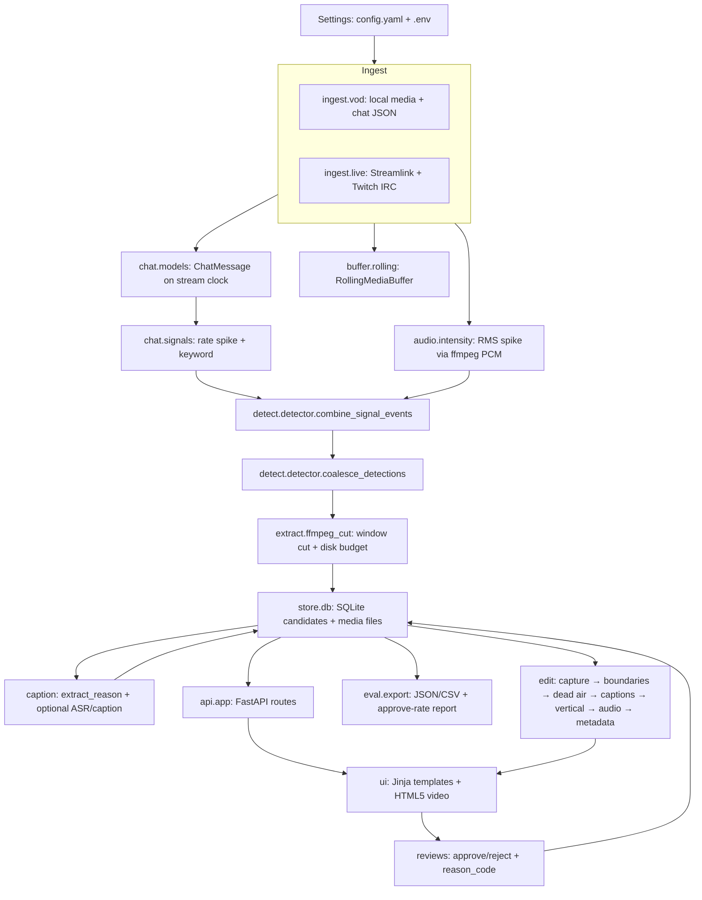
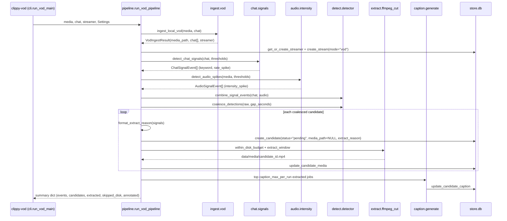
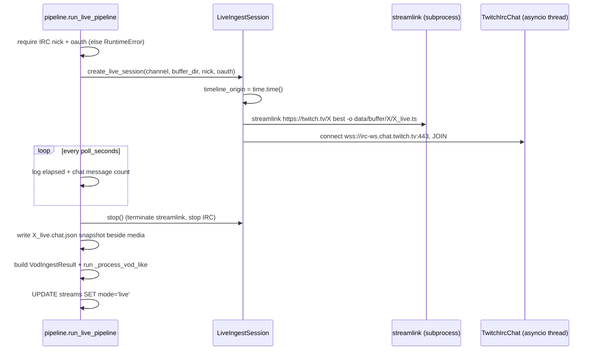
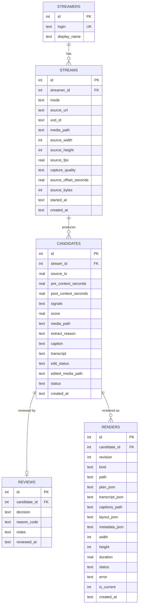

# Clippy — System Architecture

Clippy watches one Twitch channel at a time and finds the moments worth clipping. It reads two
signals — how fast chat is moving, and how loud the stream is — flags where those signals spike,
cuts each one into a short playable window, renders the good ones as vertical phone-format clips
with burned-in captions, and asks a human to approve or reject each one. Working from a local media
file is the primary path; recording a live stream is the secondary one.

It is a **candidate detector with a human review loop**, not an autonomous clipper. It never
publishes, never ranks with a trained model, and never decides on its own that a moment is worth
clipping — that judgement stays with the reviewer. What it produces is a small ranked set of
candidates, an optional rendered clip for each, and whatever labels a human gives them.

```text
detection   ingest → chat + audio events → fuse → coalesce → cut → store → annotate → review → measure
editing     candidate → capture → boundaries → dead air → captions → vertical → audio → metadata → review
```

The only question the detector has to answer is *can we consistently surface moments a human would
clip?* — and the only number that measures it is the **approve rate** over reviewed candidates.

## Contents and where to start

- **Part 1 — Orientation**
  - [What Clippy is — and is not](#what-clippy-is--and-is-not)
  - [One clock: stream-relative seconds](#one-clock-stream-relative-seconds)
  - [The pipeline at a glance](#the-pipeline-at-a-glance)
  - [Running a VOD, step by step](#running-a-vod-step-by-step)
- **Part 2 — Detection and review**
  - [Ingest: VOD and live](#ingest-vod-and-live)
  - [Chat signals](#chat-signals)
  - [Audio signals](#audio-signals)
  - [Fusing chat and audio](#fusing-chat-and-audio)
  - [Coalescing and scoring](#coalescing-and-scoring)
  - [Cutting the candidate window](#cutting-the-candidate-window)
  - [Where everything is stored](#where-everything-is-stored)
  - [Captions and transcripts](#captions-and-transcripts)
  - [The review loop](#the-review-loop)
  - [Exports and the approve-rate report](#exports-and-the-approve-rate-report)
- [From detection to editing](#from-detection-to-editing) — the bridge between the two halves
- **Part 3 — The vertical clip editor**
  - [The steps, and what a re-run reuses](#the-steps-and-what-a-re-run-reuses)
  - [Layout strategies](#layout-strategies-layout_strategy)
  - [Caption styles](#caption-styles-caption_style)
  - [Word emphasis](#word-emphasis-caption_emphasis)
  - [Caption band](#caption-band-caption_safe_area)
  - [Editing decisions and why](#editing-decisions-and-why)
- **Part 4 — Reference**
  - [Commands](#commands)
  - [HTTP surface](#http-surface)
  - [Module map](#module-map)
  - [External tools](#external-tools)
  - [Configuration](#configuration)
  - [Failure modes and operational behaviour](#failure-modes-and-operational-behaviour)
  - [Known gaps](#known-gaps)
  - [Testing](#testing)
  - [Appendix A — Glossary](#appendix-a--glossary)
  - [Appendix B — Chat JSON shapes](#appendix-b--chat-json-shapes)

---

## Part 1 — Orientation

### What Clippy is — and is not

| In scope                                                     | Out of scope (by design)                                     |
| ------------------------------------------------------------ | ------------------------------------------------------------ |
| One Twitch source per run (local VOD file or live capture)    | Multi-stream concurrency, Redis/Celery/S3                    |
| Chat rate/keyword signals + audio intensity spikes            | Scene-change and emotion CV (a face cascade is used only to frame a crop) |
| Overlap coalescing into one candidate per moment              | Learned ranker from performance metrics                      |
| FFmpeg window extraction to local MP4 files                   | Multi-clip composition, transitions, music                   |
| Optional ASR + short UI caption (API-keyed, capped per run)   | TikTok / YouTube / Instagram publishing                      |
| Vertical 1080x1920 render: reframe, dead air, burned-in captions, loudness, metadata | Twitch Clip API usage (clips are cut locally from media) |
| SQLite persistence of streams, candidates, reviews, renders   | Autonomous publish or score changes from a caption model     |
| FastAPI + Jinja review UI: approve/reject, re-render, download | Backfill captions on old rows or later re-runs               |
| Review export (JSON/CSV) + approve-rate report                | Auto-approval, or any learned editing decision               |

The design principle behind every shortcut: **score is detection confidence, not
clippability**. Humans decide clippability. ASR and captions are reviewer aids written after
extract; they never feed back into detection.

---

### One clock: stream-relative seconds

Every time in Clippy is seconds from the start of the source media, never wall-clock. That single
rule is what lets the pipeline compose: a detection offset *is* an extraction offset, so chat and
media cannot drift apart and there is no alignment step to get wrong.

- **VOD:** `t = 0` is the start of the media file. A chat dump must already be on that clock.
- **Live:** recording and chat both start from the moment capture began, so they share origin `0`.
- **The one thing not to do** is mix wall-clock with media timestamps without an explicit offset —
  it is the most failure-prone spot in the system, which is why both live chat and live media
  derive from a single recorded origin.

Chat messages are sorted by `ts` on load, which the signal scanners rely on.

---

### The pipeline at a glance

The graph below is the whole system in one picture: the detection chain, and the edit branch that hangs off the same `store`.


```mermaid
flowchart TD
  config[Settings: config.yaml + .env] --> ingest
  subgraph ingest[Ingest]
    vod[ingest.vod: local media + chat JSON]
    live[ingest.live: Streamlink + Twitch IRC]
  end
  ingest --> chatmod[chat.models: ChatMessage on stream clock]
  ingest --> buffer[buffer.rolling: RollingMediaBuffer]
  chatmod --> chatsig[chat.signals: rate spike + keyword]
  ingest --> audio[audio.intensity: RMS spike via ffmpeg PCM]
  chatsig --> detect[detect.detector.combine_signal_events]
  audio --> detect
  detect --> coalesce[detect.detector.coalesce_detections]
  coalesce --> extract[extract.ffmpeg_cut: window cut + disk budget]
  extract --> store[store.db: SQLite candidates + media files]
  store --> caption[caption: extract_reason + optional ASR/caption]
  caption --> store
  store --> api[api.app: FastAPI routes]
  api --> ui[ui: Jinja templates + HTML5 video]
  ui --> labels[reviews: approve/reject + reason_code]
  labels --> store
  store --> eval[eval.export: JSON/CSV + approve-rate report]
  store --> edit[edit: capture → boundaries → dead air → captions → vertical → audio → metadata]
  edit --> ui
```

The detection half of that picture ends at a review decision. The editing half starts from the same
`store`: `clippy-edit` turns a candidate into a rendered vertical clip and records each attempt as a
`renders` row, which the same UI then plays back for approval
(see [From detection to editing](#from-detection-to-editing)).

Everything downstream of ingest is shared. The VOD path and the live path produce the same
`VodIngestResult`-shaped object (a media file, chat messages on a stream-relative clock, and
streamer identity), so detection, extraction, storage, optional annotation, review, and
export never branch on mode. Only the ingest adapter and one `streams.mode` column differ.

---

### Running a VOD, step by step


```mermaid
sequenceDiagram
  participant CLI as clippy-vod (cli.run_vod_main)
  participant P as pipeline.run_vod_pipeline
  participant I as ingest.vod
  participant C as chat.signals
  participant A as audio.intensity
  participant D as detect.detector
  participant E as extract.ffmpeg_cut
  participant Cap as caption.generate
  participant DB as store.db

  CLI->>P: media, chat, streamer, Settings
  P->>I: ingest_local_vod(media, chat)
  I-->>P: VodIngestResult(media_path, chat[], streamer)
  P->>DB: get_or_create_streamer + create_stream(mode="vod")
  P->>C: detect_chat_signals(chat, thresholds)
  C-->>P: ChatSignalEvent[] (keyword, rate_spike)
  P->>A: detect_audio_spikes(media, thresholds)
  A-->>P: AudioSignalEvent[] (intensity_spike)
  P->>D: combine_signal_events(chat, audio)
  P->>D: coalesce_detections(raw, gap_seconds)
  loop each coalesced candidate
    P->>P: format_extract_reason(signals)
    P->>DB: create_candidate(status="pending", media_path=NULL, extract_reason)
    P->>E: within_disk_budget + extract_window
    E-->>P: data/media/candidate_id.mp4
    P->>DB: update_candidate_media
  end
  P->>Cap: top caption_max_per_run extracted jobs
  Cap->>DB: update_candidate_caption
  P-->>CLI: summary dict (events, candidates, extracted, skipped_disk, annotated)
```

`clippy-serve` then opens the review UI against the same SQLite file, and `clippy-export`
produces the eval artifacts. The commands are independent processes sharing only `data/`.

---

## Part 2 — Detection and review

Detection is a two-stage pipeline: **per-modality event extraction** followed by
**combination and coalescing**. Each stage is a pure function of its inputs plus thresholds,
so it can be reasoned about and tested independently.

---

### Ingest: VOD and live

Ingest is the only part of the system that knows whether it is looking at a file or a live
stream, and it is the only place the two modes differ. Both adapters return the same shape —
a media path, chat messages on the stream clock, and streamer identity — so nothing downstream
branches on mode.

- **VOD (`ingest/vod.py`):** validate that the media and chat files exist, parse the chat dump
  with `chat.models.load_chat_json`, and return a `VodIngestResult`. Times must already be
  stream-relative (see [Appendix B](#appendix-b--chat-json-shapes) for the accepted shapes).
- **Live (`ingest/live.py`):** record the stream while collecting chat, then hand the result to
  the exact same batch path.

`clippy-live --channel X --duration N` reuses the entire batch pipeline; only the ingest
adapter changes.


```mermaid
sequenceDiagram
  participant P as pipeline.run_live_pipeline
  participant S as LiveIngestSession
  participant SL as streamlink (subprocess)
  participant IRC as TwitchIrcChat (asyncio thread)

  P->>P: require IRC nick + oauth (else RuntimeError)
  P->>S: create_live_session(channel, buffer_dir, nick, oauth)
  S->>S: timeline_origin = time.time()
  S->>SL: streamlink https://twitch.tv/X best -o data/buffer/X/X_live.ts
  S->>IRC: connect wss://irc-ws.chat.twitch.tv:443, JOIN #x
  loop every poll_seconds
    P->>P: log elapsed + chat message count
  end
  P->>S: stop() (terminate streamlink, stop IRC)
  P->>P: write X_live.chat.json snapshot beside media
  P->>P: build VodIngestResult + run _process_vod_like
  P->>P: UPDATE streams SET mode='live'
```

- **Recording:** streamlink writes one continuously growing `.ts` into
  `data/buffer/{channel}/`; ads are disabled (`--twitch-disable-ads`) and stream retries are
  configured (`--retry-streams 5 --retry-max 10`). Missing streamlink, or a zero-byte output,
  raises a clear `RuntimeError`.
- **Chat:** a daemon thread runs its own asyncio loop hosting the IRC client; messages are
  appended to an in-memory list through the `on_message` callback. The IRC client requests
  `twitch.tv/tags twitch.tv/commands`, answers `PING` with `PONG`, reconnects after 3 s on any
  exception, and strips an optional `oauth:` prefix from the token.
- **Detection timing:** detection runs **after** the recording window closes, not continuously.
  This is a deliberate simplification — it removes the need for a rolling segment index
  and a streaming detector, and the same thresholds then apply identically to VODs and live
  captures. The shared `_process_vod_like` path also runs extract-reason + optional caption.
- **Chat snapshot:** `X_live.chat.json` is written next to the media for reproducibility, so a
  live session can be re-analysed offline or after threshold changes.
- **`RollingMediaBuffer`** is wired into the session (`set_source_media`) and provides
  `add_segment` / `prune` for age-bounded retention, but because detection is post-hoc and
  streamlink already writes a single file, no pruning is currently triggered on the live path —
  it is the designed seam for a future true streaming detector.

---

### Chat signals

Two independent detectors run over the same message list:

1. **Keyword hits** — whole-phrase match (case-insensitive, word-boundary) against
   `chat_keywords` via `chat.keywords.first_keyword`. The default list (`clip it`,
   `clip that`, `clip this`, `clip`) is checked in order, so the specific phrases win over
   the generic `clip`. A message like `clippers are winning` does **not** match `clip`.
   Each hit emits an event at the message `ts` with `score = chat_keyword_score` (0.7) and
   details `{keyword, user, text}`.
2. **Rate spikes** — a two-pointer sliding window evaluated at each message timestamp:
   - `window_rate = messages in the last chat_window_seconds / chat_window_seconds`
   - `baseline_rate = messages in the last chat_baseline_seconds / chat_baseline_seconds`
   - Emitted only when `window_rate >= chat_min_rate`, `baseline_rate > 0`, and
     `window_rate >= baseline_rate * chat_spike_multiplier` (3.0× by default).
   - Events closer together than `chat_window_seconds` are suppressed so one burst cannot
     produce a dense cluster of spikes.
   - Score is fixed at `chat_spike_score` (0.85); details carry `window_rate`,
     `baseline_rate`, the ratio, and `window_count`.

Both detectors finish with `_dedupe_nearby(gap=1.0)`, which keeps the higher-scoring event
when two events of the *same kind* land within a second of each other.

*Design note:* rates are computed over **message counts in a time window**, not over
fixed-size zero-filled buckets, so long quiet stretches are represented by a low baseline
rather than a bucket full of zeros. That makes the multiplier sensitive in quiet IRL chat,
which is exactly where `CLIP IT` bursts matter — and it is also the knob most likely to need
tuning per channel (`chat_spike_multiplier`, `chat_min_rate`).

*In code:* `chat/signals.py` → `detect_chat_signals`; keywords come from
`chat/keywords.py` → `first_keyword`.

---

### Audio signals

1. `extract_mono_pcm` decodes the whole media file to mono 16 kHz float32 little-endian PCM
   through an ffmpeg stdout pipe (`-ac 1 -ar 16000 -f f32le pipe:1`).
2. `compute_rms_series` reshapes samples into `audio_frame_seconds` (0.5 s) frames and takes
   per-frame RMS, with each frame timestamped at its midpoint `(i + 0.5) * frame_seconds`.
3. `detect_audio_spikes` walks the series and computes a local baseline as the mean RMS of
   the preceding `audio_baseline_seconds` (30 s) of frames. An event is emitted when the frame
   passes an **absolute floor** (`rms >= audio_min_rms`, 0.02) *and* a **relative spike**
   (`rms >= baseline * audio_spike_multiplier`, 2.5×), with a `2 * frame_seconds` refractory
   period between emissions. Details carry `rms`, `baseline_rms`, and `multiplier`; score is
   `audio_spike_score` (0.75).

The absolute floor exists so near-silence frames cannot produce spikes from tiny baselines;
the relative term is what actually signals a shout, laugh, or loud reaction.

*In code:* `audio/intensity.py` → `extract_mono_pcm`, `compute_rms_series`, `detect_audio_spikes`.

---

### Fusing chat and audio

Chat and audio events are fused into `RawDetection` rows:

- For each chat event, the **nearest unused audio event within 5 seconds** is consumed. The
  fused detection is tagged `kind="chat_audio"`, keeps the chat timestamp, and scores
  `min(1.0, chat.score + 0.5 * audio.score)` — i.e. a chat spike plus a nearby loud moment
  outranks either alone, which is the strongest signal the detector has.
- Chat events with no audio partner become `kind=<chat kind>` detections at their own score.
- Audio events that were never consumed become their own detections, so a loud moment with no
  chat reaction is still surfaced for review.
- Output is sorted by `ts`.

*In code:* `detect/detector.py` → `combine_signal_events` (returns `RawDetection` rows).

---

### Coalescing and scoring

Raw detections are sorted and clustered: a detection joins the current cluster when it is
within `coalesce_gap_seconds` (20 s) of the previous detection. Each cluster becomes exactly
**one** `CoalescedCandidate`, satisfying the success criterion "overlapping spikes collapse to
one candidate per moment":

- `ts` = timestamp of the highest-scoring detection in the cluster (the peak), not the mean.
- `score` = that peak score (cluster max).
- `signals` = `{events: [...], event_count: N, kinds: [...]}` plus the peak event's own fields
  at the top level, so the review UI can show both the summary and the primary signal.

There is intentionally **no learned ranking** and no cross-modality normalization beyond the
above; the score ordering only has to be good enough to sort the review queue.

Window length and every threshold live in `Settings`, while scores are per-signal-kind constants
plus one fusion boost, so a reviewer reading a candidate's signals JSON can say why it ranked
where it did. Captions are labels on top of that ranking, never a second score.

*In code:* `detect/detector.py` → `coalesce_detections` (returns `CoalescedCandidate`).

---

### Cutting the candidate window

A candidate is a timestamp, not a file. Extraction turns it into something a reviewer can
watch, and it is the step most likely to run short of disk — which is why the budget lives here.

For each coalesced candidate the pipeline computes the clip window from config, not from the
signal:

```text
start    = max(0.0, source_ts - pre_context_seconds)
duration = pre_context_seconds + post_context_seconds     # 60 s by default
output   = data/media/candidate_{candidate_id}.mp4
```

- Extraction is a **re-encode** (`-c:v libx264 -preset veryfast -crf 23 -c:a aac
  -movflags +faststart`). This costs CPU but was chosen deliberately: stream-copy cuts on
  Twitch VODs can drift or start on a keyframe far from the requested `-ss`, which would break
  the "the moment sits inside the clip" contract reviewers rely on.
- `format_extract_reason(signals)` runs **before** the insert so every row — extracted,
  disk-skipped, or ffmpeg-failed — stores a human-readable why-this-clip string.
- The candidate row is inserted **first** (`media_path=NULL`, `extract_reason` set), then
  media is attached with `update_candidate_media`. If ffmpeg fails, the exception is logged
  and the candidate remains in the review queue with no playable media (`No media extracted`
  in the UI) instead of disappearing.
- `within_disk_budget(media_dir, disk_budget_gb)` sums the byte size of everything under
  `data/media` and compares against `disk_budget_gb` (20 GB default). The check runs before
  every extract; once the budget is hit, **all remaining candidates are still persisted**
  without media and counted in `skipped_disk` in the run summary. Nothing silently vanishes.

*In code:* `extract/ffmpeg_cut.py` → `extract_window`, `within_disk_budget`; the human-readable
reason is `caption/reason.py` → `format_extract_reason`.

---

### Where everything is stored

SQLite, one file (`data/clippy.db`), no ORM. `Database` opens a short-lived connection per
operation through a `connection()` context manager (`PRAGMA foreign_keys = ON`, commit on
success, rollback on error). Schema create is idempotent (`CREATE TABLE IF NOT EXISTS`).
Existing databases pick up new columns through `TABLE_MIGRATIONS`: `CANDIDATE_COLUMN_MIGRATIONS`
(`ALTER TABLE ... ADD COLUMN` for `extract_reason`, `caption`, `transcript`, `edit_status` and
`edited_media_path` when missing) and `STREAM_COLUMN_MIGRATIONS` (the capture metadata columns
`source_width`, `source_height`, `source_fps`, `capture_quality`, `source_offset_seconds` and
`source_bytes`).


```mermaid
erDiagram
  STREAMERS ||--o{ STREAMS : has
  STREAMS ||--o{ CANDIDATES : produces
  CANDIDATES ||--o| REVIEWS : "reviewed by"
  CANDIDATES ||--o{ RENDERS : "rendered as"

  STREAMERS {
    int id PK
    text login UK
    text display_name
  }
  STREAMS {
    int id PK
    int streamer_id FK
    text mode
    text source_url
    text vod_id
    text media_path
    int source_width
    int source_height
    real source_fps
    text capture_quality
    real source_offset_seconds
    int source_bytes
    text started_at
    text created_at
  }
  CANDIDATES {
    int id PK
    int stream_id FK
    real source_ts
    real pre_context_seconds
    real post_context_seconds
    text signals
    real score
    text media_path
    text extract_reason
    text caption
    text transcript
    text edit_status
    text edited_media_path
    text status
    text created_at
  }
  REVIEWS {
    int id PK
    int candidate_id FK
    text decision
    text reason_code
    text notes
    text reviewed_at
  }
  RENDERS {
    int id PK
    int candidate_id FK
    int revision
    text kind
    text path
    text plan_json
    text transcript_json
    text captions_path
    text layout_json
    text metadata_json
    int width
    int height
    real duration
    text status
    text error
    int is_current
    text created_at
  }
```

`mode` is constrained to `vod|live`, `status` to `pending|approved|rejected`, `decision`
to `approved|rejected`, `edit_status` to `unrendered|rendering|rendered|failed`, render `kind`
to `plan|rough|final`, and render `status` to `ok|failed`. Indexes:
`idx_candidates_stream_score(stream_id, score DESC)`, `idx_candidates_status(status)`,
`idx_renders_candidate(candidate_id, revision DESC)` and `idx_renders_current(candidate_id,
is_current)`. The review queue is always "pending, highest score first", which the candidate
indexes cover.

**Invariants and conventions**

- `signals` is JSON text; the repository serializes on write and deserializes into `dict` on
  read, so callers always see Python structures (`Candidate.signals`).
- `extract_reason`, `caption`, and `transcript` are nullable text. `extract_reason` is set at
  insert. `caption` / `transcript` are filled later by `update_candidate_caption` and may
  stay null forever.
- `reviews.candidate_id` is `UNIQUE`, and `review_candidate()` upserts (insert or update) and
  then writes back `candidates.status = decision`. Reviewing is therefore idempotent and
  re-reviewable; `candidates.status` is a denormalized copy that exists purely to make the
  queue query fast and to keep the schema self-describing.
- Queue ordering is `ORDER BY c.score DESC, c.source_ts ASC`, deterministic for equal scores.
- `reason_code` is validated against `REJECTION_REASONS = (false_alarm, needs_context,
  too_long, boring, unsafe, bad_edit, bad_captions, other)` and is only meaningful for
  rejections (the API clears it on approve). The two edit-specific codes exist so a rejected
  *render* can be distinguished from a rejected *moment*.
- `renders` is append-only history: every plan or render writes a row with an incrementing
  `revision`, and at most one row per candidate carries `is_current = 1`. `candidates.edit_status`
  and `candidates.edited_media_path` are denormalized copies of the current render's outcome,
  mirroring how `candidates.status` mirrors the review.
- Dataclasses (`Streamer`, `Stream`, `Candidate`, `Review`, `CandidateView`) are the only
  objects crossing the storage boundary; `CandidateView` joins candidate + review + streamer +
  stream mode so templates never issue queries.
- Timestamps are ISO-8601 UTC strings (`utc_now()`). They are audit metadata only and are never
  used for signal math, which uses stream-relative seconds exclusively.

*In code:* `store/db.py` → `Database`; existing databases pick up new columns through
`TABLE_MIGRATIONS`.

---

### Captions and transcripts

An optional, best-effort pass that adds a short description and a transcript to clips that were
**already extracted in this run**. It never changes a score, a window bound, or a review decision;
it only adds reading material to the review page and the export.

- **Scope.** At most the top `caption_max_per_run` extracted clips (default 20, highest score
  first). No API key → the pass is skipped and the run summary reports `annotated: 0`.
  Disk-skipped rows and ffmpeg failures are never annotated.
- **What it does.** Builds a cleaned-up chat window around the moment, transcribes the extracted
  MP4, then asks the caption model for a short 3–10 word description.
- **Partial results survive.** Only the fields that were produced are written, so a transcript
  whose caption call failed is still saved and the other field is left untouched. Per-clip ASR or
  caption failures are logged and the run continues.
- **No later pass.** Re-running the pipeline creates new candidates; it does not backfill
  captions on old rows.

**Two different things are called "captions".** This pass writes a *review label* — shown in the
review UI and exported. The burned-in on-screen text is a separate track produced by the
[editor](#from-detection-to-editing). `extract_reason` is a third, unrelated field: why the clip
was cut, always present even when there is no caption.

*In code:* `caption/generate.py` → `annotate_extracted_candidate`; the chat window is
`caption/chat_context.py`, transcription is `caption/asr.py`, and the write is
`db.update_candidate_caption`.

---

### The review loop

Deliberately the smallest thing that can collect a label: HTML pages, an HTML5 video element, one
form, no JavaScript. A reviewer opens the grid, watches a clip, and approves or rejects it with an
optional reason code — and that label is what the whole system is ultimately scored on.

- **Grid (`/`)** — candidates ranked by score, pending first, each with an inline player, the
  caption or extract reason, and the stream mode. A status filter switches between pending,
  approved, rejected and all.
- **Candidate page** — the full clip, the signals behind it, the transcript, the current render
  and its warnings, and both the review and re-render forms.
- **Deciding** — approve or reject; a rejection may carry a reason code, which is dropped on
  approval. The write is idempotent and re-reviewable, and the redirect means a refresh cannot
  resubmit.
- **The number** — both pages show running totals and the approve rate, so the metric moves as
  you label.

Because labelling happens against the *detected* set, approve rate is a direct precision proxy
for the detector as configured: `approve_rate = approved / (approved + rejected)`. It is the
number that threshold tuning (`coalesce_gap_seconds`, spike multipliers, `chat_min_rate`) is
meant to move. Captions are not part of that metric.

*In code:* routes and templates in `api/app.py` + `ui/`; the full route table is in
[HTTP surface](#http-surface).

---

### Exports and the approve-rate report

`clippy-export` writes the label set to JSON and CSV and prints the numbers that describe it. The
headline is the **approve rate** — approved ÷ (approved + rejected) over reviewed candidates — the
direct precision proxy for the detector as configured.

- **The exports.** `data/exports/reviews.json` and `reviews.csv`, from one flattened join across
  reviews → candidates → streams → streamers, with a fixed CSV schema so downstream analysis does
  not break.
- **The weak-label check.** Counts candidates whose signals mention the `clip` keyword — a rough
  recall sanity check: if chat screamed `CLIP IT` and no candidate was produced, recall is failing
  even when precision looks fine.
- **No ground truth by design.** Human labels *are* the ground truth, so there is no automatic
  comparison; `clippy-export` simply prints the report and writes both files.

*In code:* `eval/export.py` → `export_reviews_json`, `export_reviews_csv`, `precision_report`.

---

## From detection to editing

Detection answers *which moments*. The editor answers *can this moment be published as it stands* —
and if not, what a reviewer still has to fix first. Both halves share the same database and the same
stream-relative clock, so they never disagree about *when* something happened.

Everything so far turned signals into a reviewable candidate. The rest of this document turns a
candidate into a finished vertical clip.

---

## Part 3 — The vertical clip editor

The second half of the system: turning a reviewed candidate into a 1080x1920 clip that could be
posted as it stands. It runs as a short sequence of steps that cache their work, so a re-run only
redoes what changed. The rest of this part covers those steps, the reviewer-facing choices that
shape them, and why the defaults are what they are.

### The steps, and what a re-run reuses

An edit is an ordered sequence of steps:

```text
HQ capture → bounds → base → dead air → captions → vertical → audio → metadata → review
```

`HQ capture` is the input (a high-quality copy of the source, fetched by `clippy-capture`) and
`review` is the human decision at the end. Every step in between writes one artifact under
`data/edits/<candidate_id>/`:

| step | what it does | how | artifact |
| --- | --- | --- | --- |
| bounds | picks where the clip starts and ends, before any media is touched | the chat reaction curve (`detect_bounds`), falling back to the fixed review window when there is no chat evidence | `plan.json` |
| base | cuts the exact source window, untouched | one ffmpeg re-encode of the capture at `intermediate_crf` | `base.mp4` |
| dead air | removes silent stretches and resolves the framing | `silencedetect` with guard bands and a payoff cap, then the layout/track pass | `trimmed.mp4`, `layout.json` |
| captions | turns word timings into readable cues and a subtitle track | ASR word timings → cue grouping → karaoke or plain ASS | `captions.ass`, `transcript.json` |
| vertical | fills 1080x1920 and burns the captions in | a single ffmpeg pass: crop / scale / overlay / concat / subtitles | `vertical.mp4`, `compose.inputs.json` |
| audio | levels the loudness | two-pass `loudnorm` with a true-peak limit | audio replaced in `final.mp4` |
| metadata | writes the publish metadata and a cover frame | a validated model proposal (deterministic fallback), plus a frame grab | `final.mp4`, `metadata.json`, `thumbnail.jpg` |

**A `stage` is a checkpoint, not a step.** `plan.json` carries a `stage` field with exactly three
values, set as a run passes them: `planned` once the bounds are chosen, `composed` once
`vertical.mp4` exists, and `complete` once the audio and metadata steps have finished. It is a
progress marker for the logs and the candidate page — it is *not* a cache key. What a re-run reuses
is decided from the artifacts themselves: a step whose output already exists is skipped, and
composition additionally reads `compose.inputs.json` to check that the pixels, the caption text,
the layout and the encode settings still match the video it finds.

The `bounds` step also leaves `boundary_transcript.json` behind: a word-timed transcript of the
review window. No later step consumes it, so it is not a step artifact — it is the evidence the
cut was actually made on, kept so a reviewer can see why the bounds landed where they did.

Four rules keep the steps composable:

1. **Times on the trimmed timeline.** Captions are transcribed from `trimmed.mp4`, so no cue
   ever needs remapping after a cut.
2. **Every step caches, and composition checks its own inputs.** A step whose artifact already
   exists is skipped without `--force`, but composition can tell whether the artifact it finds
   still matches the pixels, the caption text, the framing and the encode settings that are now
   on offer (`compose.inputs.json`), and the loudness pass refuses a `final.mp4` older than the
   `vertical.mp4` it came from. `--force` discards everything for that candidate.
3. **Framing is resolved before captions.** Reading the frame is what tells the caption step
   whether the band has to move, so the layout (and `layout.json`) is planned immediately after
   the dead-air cut rather than at the end of composition. It is resolved once and handed to the
   composition step, so the frame sampling is never paid for twice.
4. **Steps read the plan, not `Settings`.** `build_plan` resolves the config default and any CLI
   or UI override once and writes the result into `plan.json`; every later step reads that record,
   which is what makes an override survive a re-run.

Re-rendering is cheap on purpose, and worth knowing exactly. Without `--force`:

- `base.mp4`, `trimmed.mp4` and `transcript.json` are **reused**.
- `captions.ass` is **rebuilt from the cached transcript**, so no ASR is paid for.
- `vertical.mp4` is reused only when its inputs still match it — the trimmed pixels, the caption
  text, the resolved layout and the encode settings are fingerprinted into `compose.inputs.json`.
  A caption-style change therefore re-encodes and reaches the MP4 on its own, while a no-op re-run
  does not encode at all.
- `final.mp4` obeys the same principle in a simpler form: it is reused only while it is newer than
  the `vertical.mp4` it came from.

`--force` skips all of it and rebuilds every step, including ASR.

---

### Layout strategies (`layout_strategy`)

The deliverable is 1080x1920 (`clip_target_width` x `clip_target_height`) at `clip_fps`
(`0` follows the source). Filling a 9:16 canvas from a 16:9 source always needs a decision,
and that is what the strategy picks:

| strategy | what it does | requirement | layers in `layout.json` |
| --- | --- | --- | --- |
| `fit_blur` | the whole frame scaled to fit width, with a blurred, cropped copy of the same frame filling the rest | none; the honest answer for low-resolution footage | blurred background + fitted video |
| `irl` | a tracked `source_h x 9/16` crop, subject held near centre, pan smoothed, zoom clamped | needs `min(width, height) >= 720` (`MIN_TRACKED_SOURCE_HEIGHT`) | one crop layer per tracked span |
| `gaming` | gameplay crop on top with the facecam in the panel below (gameplay occupies `0,0,1080,1152`, i.e. the top 60%) | a `facecam_box` (typed or `auto`-derived from the face track) | gameplay + facecam layers |
| `conversation` | splits the frame into two panels instead of tracking who is speaking | two stable motion regions | two panel layers |
| `auto` | chooses from evidence, then never resolves at plan time | - | whatever it chose |

`auto` is resolved during composition by `resolve_strategy()`, in this order:

1. a configured or derived `facecam_box` → `gaming`
2. otherwise `min(source_width, source_height) >= 720` → `irl`
3. otherwise `fit_blur`

then these downgrades and warnings apply, all recorded on the plan rather than applied silently:

| condition | result | warning code |
| --- | --- | --- |
| `irl` or `conversation` with `source_height < 720` | forced to `fit_blur` | `low_resolution_layout` |
| `gaming` with no facecam box | forced to `fit_blur` | `facecam_box_missing` |
| `facecam_box: auto` produced a box | box kept, warning added | `facecam_box_auto` |
| `facecam_box: auto` produced no box | box `None`; `gaming` degrades to `irl`/`fit_blur` | `facecam_box_auto_failed` |
| `irl` or `conversation` with `layout_track_backend: none` | strategy kept, but nothing tracks | `tracking_unavailable` |
| resolved `upscale_factor > quality_warn_upscale` (2.0) | strategy kept, warning added | `upscale_exceeds_threshold` |

Before composition has run, `layout.resolved_strategy` is empty and the plan carries
`layout_pending`, which is what tells a reviewer "this plan has not been rendered yet". The
upscale warning is not a defect: even a 1080p16:9 source is a ~1.8x upscale to fill 1080x1920
natively, handled with lanczos plus a mild `unsharp`; only 1440p/4K capture makes it near-native.

Supporting knobs, all of which only matter once a crop strategy is chosen:

| key | default | effect |
| --- | --- | --- |
| `layout_track_backend` | `motion` | `none` disables tracking (and warns), which also leaves the caption band where it is because there is no evidence; `motion` uses a numpy motion map; `opencv` uses the bundled Haar face cascade for both a subject box and a vertical position (see below); `mediapipe` is accepted but not implemented and falls back to motion |
| `layout_smoothing` | `0.12` | crop-pan responsiveness; `1.0` is unsmoothed and visibly twitchy |
| `facecam_box` | `""` | `"x,y,w,h"` (fractions when the values are `<= 1`, else pixels), or `auto` to derive it from the face track |
| `facecam_pad` | `1.6` | headroom grown around the derived face before it becomes the panel's source rectangle (`auto` only) |
| `layout_zoom` | `1.0` | tightens the tracked crop around the subject (above `1.0` the crop shrinks, so it upscales more); `irl` only |
| `crop_bias` | `0.0` | horizontal nudge (normalised) for a mis-framed `irl` crop; override-only, so there is no config key - set it through `EditOverrides` |

**Deriving the facecam box (`facecam_box: auto`).** A hand-typed box is the reliable path, but it
needs coordinates the streamer may not know. `auto` derives one from the clip's own face track:
`facecam_box_from_track()` (pure, in `edit/layouts.py`) takes the tracked face boxes and uses the
**median** centre and size (so one stray detection cannot drag it). The detected box is only the
*face*, though, so it is grown by `facecam_pad` and then widened to at least `FACECAM_MIN_WIDTH`
(0.22 of the source) - a panel should show a webcam tile, not a close-up of one cheek - and shaped to
the panel's aspect (`gaming_panel_aspect`) so `_crop_inside` does not re-crop and shift the window.
The tile is **centred on the face** and clamped to the frame; it is deliberately never snapped to a
frame edge, because the tile is small relative to the frame and snapping would move the crop off the
face entirely. It is resolved in `plan_composition` - the first place a face track exists - and then
travels the exact same `facecam_box` path a typed box does, `gaming` and all. It needs real face
boxes, so it requires `layout_track_backend: opencv`; with the motion backend the track carries no
box, so `auto` warns (`facecam_box_auto_failed`) and the layout degrades to `irl`/`fit_blur`. The box
that was used is written back to `plan.json` as fractions with a `facecam_box_source` of `config` or
`auto`, which also makes a re-render reuse the same box instead of deriving a new one.


Two internal constants shape the look and are not configurable: a crop only moves when the
subject moves beyond `TRACK_DEADBAND` (0.02), and one clip is capped at `MAX_TRACK_SEGMENTS`
(24) spans so the filter graph stays small. That deadband is why a tracked crop looks calm
instead of continuously drifting.

The same decode also yields a **vertical** motion centroid and, with
`layout_track_backend: opencv`, a **face box** per sampled frame.

**The motion backend (default)** reports a centroid and no box. Its vertical centroid is not used
to position the crop - without detection, a vertical crop would chase noise - but it is part of the
evidence behind `caption_safe_area: auto` ([Caption band](#caption-band-caption_safe_area)), which
only needs to know which slice of the canvas the motion occupies across the whole clip.

**The face backend** (`layout_track_backend: opencv`, in `edit/faces.py`) reports a real face box,
which feeds two things: the vertical crop position and the caption band test. It is deliberately
gated rather than trusted: detection runs on small grayscale frames (`face_detection_width`) and
ignores anything smaller than `face_min_size_ratio` of the frame.

Detections are then **clustered across the whole clip** and voted on, because a per-frame greedy
pick lets one oversized or one-frame detection hijack the crop. Each detection joins the nearest
cluster whose **most recent** box is close enough (centre within `CLUSTER_MAX_JUMP`, 0.15 of the
frame) and similar enough in size (area within `CLUSTER_SIZE_RATIO`, 2.5x of that box) - otherwise it
starts its own cluster, so a game character, an on-screen poster/thumbnail or a second person becomes
a separate candidate. Comparing against the most recent box (rather than the cluster's median) is
what keeps a face that slowly drifts or whose detected size jitters as one cluster instead of
splitting it into half-persistent fragments. Candidates seen in fewer than `face_min_hits` sampled
frames are dropped first, then the winner is the cluster with the best **time-weighted face area**
(`persistence x median area`), so a small face that merely rides along inside a screenshot, a post
thumbnail or an avatar cannot outvote the bigger webcam. The winner is rejected entirely unless it
is seen in at least `face_min_hit_ratio` of sampled frames - at which point the clip falls back to
motion. Only the
winning cluster's detections move the track; the frames it missed carry its last position forward, so
the track stays dense and the layout stays calm. Each `face_track` call logs the number of candidate
faces, the winner's persistence and the runner-up, so a shaky pick is visible.

OpenCV is imported lazily, so nothing else in the package needs it, and a detector failure is logged
and degraded rather than fatal.

| key | default | effect |
| --- | --- | --- |
| `face_detection_width` | `480` | width of the grayscale frames the cascade sees: a speed/accuracy tradeoff |
| `face_min_size_ratio` | `0.06` | smallest face worth believing, as a fraction of the frame |
| `face_min_hit_ratio` | `0.2` | below this share of sampled frames the **chosen** face is rejected and motion takes over |
| `face_min_hits` | `4` | sampled frames a face must appear in to be a candidate; drops one-off giant detections |

---

### Caption styles (`caption_style`)

`caption_style` picks a preset from `caption/styles.py` (`_PRESETS`), and `Settings` then
overrides individual attributes on top of it. These numbers *are* the definition of each style:

| preset | size | bold | case | karaoke | outline / shadow | `pop_scale` | look |
| --- | --- | --- | --- | --- | --- | --- | --- |
| `karaoke_highlight` | 54 | yes | UPPER | yes | 4 / 2 | 0 | words light up one at a time as they are spoken; emphasised words go bold |
| `block_pop` | 60 | yes | UPPER | no | 5 / 3 | 108 | whole cue appears at once; emphasised words pop to 108% and change colour |
| `minimal` | 44 | no | mixed | no | 3 / 1 | 0 | plain subtitle look, no highlighting theatre |

Karaoke versus plain is two different code paths in `caption/ass.py`, and the difference is
larger than it sounds:

- **Karaoke (`karaoke_text`)** writes a `\k` duration per word and *swaps* the style colours, so
  `caption_highlight_color` becomes `PrimaryColour` and `caption_primary_color` becomes
  `SecondaryColour`. libass flips between them at each `\k` boundary, which is what makes words
  light up on the spoken beat without one Dialogue event per word.
- **Plain (`plain_text`)** uses `caption_primary_color` for both slots and recolours only the
  emphasised words inline (`{\cHIGHLIGHT\b1}word{\cPRIMARY\b<b>}`), leaving the rest of the cue
  on screen unchanged.

`pop_scale` is applied only to emphasised words, as a `\fscx108\fscy108` prefix, which is why
`block_pop` is the only preset where emphasis also changes size.

Overridable via `Settings`: `caption_font`, `caption_font_size`, `caption_primary_color`
(`&H00FFFFFF`), `caption_highlight_color` (`&H0000D7FF` — note ASS is `&HAABBGGRR`), and
`caption_uppercase`, which is ANDed with the preset, so `caption_uppercase: false` forces mixed
case for every style. `caption_font_size` defaults to `null`, which means "keep the preset's own
size" - so the three styles really do differ in size (44 / 54 / 60). Setting it to a number
forces that one size on every style, which is the escape hatch when a particular streamer's text
reads too small. An unrecognised `caption_style` silently falls back to `karaoke_highlight`,
because a stale config value must not fail a render.

Cue grouping is shared by all styles (`caption/align.py`) and bounded by:

| key | default | effect |
| --- | --- | --- |
| `caption_max_chars_per_line` | `18` | with `caption_max_lines`, sets the character budget for one cue |
| `caption_max_lines` | `2` | so the budget is `18 x 2 = 36` characters by default |
| `caption_max_cue_seconds` | `2.2` | a cue is closed before it outstays its welcome |
| `caption_min_cue_seconds` | `0.5` | short cues are stretched, to stop flicker |
| `caption_break_gap_seconds` | `0.35` | a pause this long ends the cue |

A cue also breaks at sentence-ending punctuation (`ends_sentence`). Afterwards `_normalise`
merges overlapping cues, stretches anything shorter than `caption_min_cue_seconds`, and clamps
each cue's end to the next cue's start, so the track is monotonic and no two cues can cross.

---

### Word emphasis (`caption_emphasis`)

Emphasis decides which words get highlighted. Both active modes pick from the same cap
(`DEFAULT_EMPHASIS_LIMIT`, 12 words) and the result is recorded in `captions.emphasis_words`,
along with `captions.emphasis_source` naming the mode that produced it.

**`heuristic` (default)** — `caption/align.py.pick_emphasis_words`, free and deterministic. Each
distinct word is scored and the top 12 are kept:

| signal | weight |
| --- | --- |
| the word is ALL-CAPS and longer than one character | +3 |
| the word contains a digit | +2 |
| the word is a single-word `chat_keywords` hit | +2 |
| the word is in `DEFAULT_EMOTION_WORDS` (crazy, insane, unreal, clutch, cooked, ...) | +2 |
| the word is at least `EMPHASIS_MIN_LENGTH` (9) characters long | +1 |

Two consequences are deliberate. Multi-word keywords are excluded from the keyword signal, so
`clip that` does not light up every occurrence of "that" for the rest of the clip. And the
ALL-CAPS signal depends on what ASR returned — Whisper tends to return shouting in caps, but
when it does not, that signal simply never fires and the other weights carry the decision.

**`llm`** — `caption/emphasis.py`. The transcript is sent to the same OpenAI-compatible chat
endpoint the caption pass uses (`caption_model`, `temperature 0.0`) with a prompt asking for at
most 12 words, one per line, lowercase, verbatim from the transcript. The answer is then
validated, and the validation is the point:

1. the reply is split on any non-word character, so bullets, numbering, commas and a sentence of
   preamble all degrade to plain tokens (and a `1.` list marker becomes `1`, which survives only
   if the number was actually spoken);
2. each token is lowercased and stripped of `.,!?"'()[]` — the exact normalisation
   `caption/ass.py` matches with, so no highlighted word can be one the writer cannot find;
3. a token is dropped unless it occurs in the transcript as a whole word, so anything invented,
   misspelled or multi-word never reaches the ASS file;
4. duplicates collapse and the list is capped at 12.

A hallucinating model can therefore only ever *choose among* words that were really spoken, and
the worst case is fewer highlights, never a wrong one.

**Fallback.** Any failure — HTTP error, unusable answer, nothing from the transcript — falls back
to the heuristic set rather than leaving the clip unemphasised, and the plan records both the
source (`emphasis_source: heuristic_fallback`) and a warning (`emphasis_llm_fallback`) naming the
reason. Emphasis never fails a render.

**`off`** — no emphasis: no `\k` colour swap activity beyond the karaoke baseline, no recolouring,
and `emphasis_source: off`.

Because `emphasis_source` distinguishes `heuristic`, `llm`, `heuristic_fallback` and `off`
(`none` when the caption stage never ran at all, e.g. captions disabled or no API key), a
reviewer asking "why are these words highlighted?" can answer it from `plan.json` alone.

---

### Caption band (`caption_safe_area`)

`caption_safe_area` chooses where the caption band sits, and it maps onto an ASS alignment:

| value | alignment | behaviour |
| --- | --- | --- |
| `auto` | 2 or 8 | bottom band normally; moves to the top band when the frame says the bottom is occupied |
| `bottom` | 2 | pinned to the bottom band |
| `middle` | 5 | centred vertically |
| `top` | 8 | pinned to the top band |

`auto` is the only value that consults the frame, and it can only do that because the pipeline
resolves the framing *before* the caption stage: `plan_composition` reads the subject track and
hands `caption_prefer_top` to `generate_captions`. An explicit `bottom`/`middle`/`top` is a
reviewer decision and therefore ignores that evidence entirely. An unrecognised value falls back
to `bottom`.

Two independent things can move the band, and both end up as `caption_prefer_top` in
`layout.json`:

1. **The layout owns the bottom by construction.** `gaming` puts the facecam panel in the bottom
   40%, so captions at `caption_margin_v` would sit on the streamer's face. No measurement needed.
2. **The subject track says the bottom is busy** (`caption_avoid_ratio`, default `0.25`). Per
   sampled frame the subject position is mapped from source space onto the canvas through the layer
   that carries it. The subject is the **detected face box** when the face backend is on, and
   otherwise a box of `SUBJECT_BOX_HEIGHT_RATIO` (0.25) of the frame around the motion centroid - a
   real box makes the test sharper, and its absence keeps the motion path conservative. The frame
   counts when that box overlaps the caption band. The band moves when the bottom band is covered in
   *more* than `caption_avoid_ratio` of frames **and** covered at least as often as the top band -
   otherwise the flip would trade one occluded caption for another.

The caption bands are computed from the same knobs the ASS writer uses
(`caption_font_size x CAPTION_LINE_HEIGHT x caption_max_lines`, offset by `caption_margin_v`), so
the decision is made against the strip that will actually be drawn. `layout.caption_bottom_coverage`
in `layout.json` records the measured fraction, and a `caption_band_moved` warning spells it out
in the plan.

With the face backend on, the fraction is measured against a real face rectangle; with motion it is
measured against an assumed one, and it is 0.0 whenever the input is unmeasurable (tracking off, no
frames, a degenerate band) - which leaves the captions where they were. Vertical *framing* is the
same evidence applied to the crop, and it only has room to act when the source is taller than 9:16
([Known gaps](#known-gaps)).

Measured, not assumed — one frame rendered through the real pipeline with ffmpeg 9.0.2
(1080x1920, `karaoke_highlight`, `caption_margin_v: 260`), reporting the brightest row of the
frame:

| `caption_safe_area` | peak row | brightness centroid |
| --- | --- | --- |
| `bottom` | 1620 | 1631.9 |
| `middle` | 947 | 958.9 |
| `top` | 274 | 285.9 |

The middle band is centred at row ~960 as expected, and `caption_margin_v` does **not** move it:
changing `caption_margin_v` from 260 to 900 leaves the middle band at the identical row 947,
because libass only uses the vertical margin to position the bottom and top bands. `margin_v`
therefore means "distance from the bottom (or top) edge" and has no effect on `middle`.

---

### Editing decisions and why

**Capture `best`, then let clips decide alignment.** Streamlink was originally invoked at
`worst` quality, which made every downstream stage fight a 284x160 source. Capture now asks for
`best` and records the real dimensions. Chat-vs-audio alignment produced a confident-looking
`+30 s` offset (score 0.14) on the first real VOD; ground truth from clip correlation showed the
offset was `0` (scores 0.94-0.99). Chat alignment now only *warns*, and
`verify_offset_with_clips` is the sole authoritative applier.

**Dead air without a speech model.** `silencedetect` plus a guard band, a minimum gap size, a
removal cap, and payoff protection — but no word veto, because words only exist after the cut.
[Known gaps](#known-gaps) explains why. Cuts are *removals first, speed-ups second*: speeding up a
reaction to save 0.4 s reads as a glitch, so speed is used only when a gap is long and the cap
is already reached.

**Captions degrade, never fail.** ASR is asked for `verbose_json` with word timings; a server
that rejects word granularity is retried segment-only, and word times are then interpolated
across each segment so karaoke still tracks roughly. Groq accepts the parameter but returns
`words` beside `segments`; that shape is folded back in rather than silently re-interpolated.
No API key, an ASR error, or an empty transcript leaves the plan explaining why and the render
continues without burned-in text.

**One video encode.** `compose_vertical` does crop/scale/overlay/concat/caption-burn in a single
pass; `normalize_audio` then copies the video stream and re-encodes only audio. `base.mp4` is cut
at `intermediate_crf` (16) to keep the source window clean, while `trimmed.mp4` (dead air) and
`vertical.mp4` are encoded at `render_crf` (20) — only the source window carries the lower
intermediate CRF.

**Layouts are segments, not expressions.** A tracked crop becomes spans with a static rectangle
each, concatenated in the same pass. A crop therefore only moves when the subject genuinely
moves (deadband), which looks calmer than a continuously drifting expression, and `layout.json`
stays readable by a human.

**Metadata is validated or replaced.** A model proposal is accepted only where the transcript,
chat or streamer identity supports it — an invented hashtag is dropped, an empty title is
rejected, and any failure falls back to deterministic text with a recorded reason.

---

## Part 4 — Reference

### Commands

| Command          | Function                     | What it does                                                                 |
| ---------------- | ---------------------------- | ---------------------------------------------------------------------------- |
| `clippy-vod`     | `cli.run_vod_main`           | VOD/local media + chat JSON → detect → extract → persist → optional annotate; prints summary JSON |
| `clippy-live`    | `cli.run_live_main`          | Records live via Streamlink + IRC for `--duration`, then runs the same batch path |
| `clippy-serve`   | `cli.serve_main`             | `uvicorn.run(create_app(settings), host, port)`                              |
| `clippy-export`  | `cli.export_main`            | Writes `data/exports/reviews.json` + `reviews.csv`, prints the stats report    |
| `clippy-edit`    | `cli.edit_main`              | Plans and renders vertical clips for candidates: `--candidate`, `--stream`, `--all-pending`, `--dry-run`, `--force`, plus strategy/caption/dead-air overrides; prints a summary JSON |
| `clippy-capture` | `cli.capture_main`           | Downloads a Twitch VOD at high quality via `streamlink` or `yt-dlp`, verifies the timeline, optionally attaches it to a stream row and prunes `data/source` |

`scripts/*.py` are one-line wrappers around the same functions for people who prefer
`python scripts/run_vod.py ...`. All commands accept `--config <path>` and call
`get_settings.cache_clear()` before loading, so a per-run config file is honoured.

---

### HTTP surface

| Route                                | Purpose                                                      |
| ------------------------------------ | ------------------------------------------------------------ |
| `GET /`                               | Candidate grid, ranked by score; `?status=pending\|approved\|rejected\|all` |
| `GET /candidates/{id}`                | Detail page: video, extract reason, caption/transcript, raw signals JSON, review form |
| `POST /candidates/{id}/review`        | Form post with `decision`, `reason_code`, `notes`; 303 redirect back to `/` |
| `GET /media/{id}`                     | Streams the extracted MP4 from `candidates.media_path`        |
| `POST /candidates/{id}/render`        | Synchronous create/re-render with `strategy`, `caption_style`, `caption_emphasis`, `chat_path` and `force` overrides; 303 back to the candidate. Works before a plan exists; a chat path that is not on disk is a 400 |
| `POST /candidates/{id}/metadata`      | Saves reviewer-edited title/description/hashtags into `plan.json` |
| `GET /renders/{id}/media`             | Streams one render revision from `renders.path`               |
| `GET /candidates/{id}/download`       | `final.mp4` as an attachment                                  |
| `GET /api/stats`                      | JSON stats (same payload as the eval report)                  |
| `/static/*`                           | Mounted `ui/static` (CSS)                                     |

`create_app()` constructs `Settings`, ensures data directories exist, and opens the
`Database` once at startup, storing both on `app.state`.

---

### Module map

| Path                              | Responsibility                                                                                  |
| --------------------------------- | ----------------------------------------------------------------------------------------------- |
| `src/clippy/config.py`            | `Settings` (pydantic-settings), YAML override loading, path resolution, `ensure_dirs()`          |
| `src/clippy/pipeline.py`          | Orchestration: `run_vod_pipeline`, `_process_vod_like`, `run_live_pipeline`, caption job selection |
| `src/clippy/cli.py`               | Argparse entry points + logging config                                                           |
| `src/clippy/ingest/vod.py`        | Offline ingest: validates paths, loads chat, returns `VodIngestResult`                           |
| `src/clippy/ingest/live.py`       | `LiveIngestSession`: Streamlink subprocess + IRC thread, chat buffering, stop/cleanup             |
| `src/clippy/buffer/rolling.py`    | `RollingMediaBuffer`: segment storage with age-based pruning for bounded live retention           |
| `src/clippy/chat/models.py`       | `ChatMessage` + tolerant `load_chat_json` (multiple schema shapes)                                |
| `src/clippy/chat/keywords.py`     | Whole-phrase / word-boundary keyword match (`first_keyword`, `has_keyword`)                       |
| `src/clippy/chat/signals.py`      | `detect_chat_signals`: keyword hits + sliding-window rate spikes, near-duplicate suppression      |
| `src/clippy/chat/irc.py`          | Minimal Twitch IRC-over-WebSocket client (tags, PING/PONG, auto-reconnect, stream-clock ts)       |
| `src/clippy/audio/intensity.py`   | ffmpeg → mono PCM decode, `compute_rms_series`, `detect_audio_spikes`, `probe_duration_seconds`   |
| `src/clippy/detect/detector.py`   | `RawDetection` / `CoalescedCandidate`, `combine_signal_events`, `coalesce_detections`             |
| `src/clippy/extract/ffmpeg_cut.py`| `extract_window` (re-encode cut), `media_dir_size_bytes`, `within_disk_budget`                     |
| `src/clippy/caption/reason.py`    | `format_extract_reason`: human-readable why-this-clip string from coalesced signals               |
| `src/clippy/caption/chat_context.py` | Windowed, despammed chat payload for the caption model                                      |
| `src/clippy/caption/asr.py`       | OpenAI-compatible Whisper transcription of the cut MP4                                           |
| `src/clippy/caption/generate.py`  | `annotate_extracted_candidate`: ASR + short caption; never raises for missing keys/API errors     |
| `src/clippy/caption/align.py`     | Word timings → readable cues, and the heuristic emphasis scorer (`pick_emphasis_words`)            |
| `src/clippy/caption/styles.py`    | Caption style presets + `Settings` overrides, resolved to a `CaptionStyle`                         |
| `src/clippy/caption/ass.py`       | ASS track writing: karaoke `\k` timings vs. plain recoloured text                                  |
| `src/clippy/caption/emphasis.py`  | Optional LLM emphasis (`caption_emphasis: llm`) with transcript-membership validation              |
| `src/clippy/ingest/capture.py`    | HQ VOD download (`streamlink`/`yt-dlp`), timeline alignment reporting, `data/source` pruning     |
| `src/clippy/ingest/align.py`      | Chat-vs-media offset probe and clip-correlation verification (`verify_offset_with_clips`)         |
| `src/clippy/edit/pipeline.py`     | Edit orchestration: `run_edit_pipeline`, job resolution/selection, stage sequencing                |
| `src/clippy/edit/plan.py`         | `EditPlan`, `EditPaths`, `build_plan`, `EditOverrides`, warning codes                              |
| `src/clippy/edit/boundaries.py`   | `detect_bounds`: clip bounds from chat evidence, with the fixed detection window as fallback       |
| `src/clippy/edit/render.py`       | `extract_base`, `apply_deadair`, `plan_composition`, `compose_vertical` + the composition fingerprint |
| `src/clippy/edit/deadair.py`      | Silence detection, guard bands, payoff protection, cut/speed removal                               |
| `src/clippy/edit/layouts.py`      | Layout strategies, segment/layer plans and the caption-band evidence                               |
| `src/clippy/edit/track.py`        | Motion tracking (`TrackPoint`), and `crop_center_y` for vertical framing                            |
| `src/clippy/edit/faces.py`        | Optional OpenCV face detection behind `layout_track_backend: opencv`                               |
| `src/clippy/edit/captions.py`     | Caption stage: cues, emphasis selection, ASS writing                                               |
| `src/clippy/edit/audio.py`        | Two-pass loudness normalization with a freshness-aware cache                                       |
| `src/clippy/edit/metadata.py`     | Clip metadata and thumbnail extraction                                                             |
| `src/clippy/store/db.py`          | SQLite schema, column migrations, dataclasses, `Database` repository, `REJECTION_REASONS`         |
| `src/clippy/eval/export.py`       | `export_reviews_json/_csv`, `precision_report`                                                     |
| `src/clippy/api/app.py`           | FastAPI app factory, routes (review, create/re-render with optional chat evidence, metadata, download/media), Jinja2 templates, static mount |
| `src/clippy/ui/`                  | `templates/base.html`, `index.html`, `candidate.html`; `static/style.css`                          |
| `tests/test_core.py`              | Chat loading, keyword boundaries, coalescing, chat+audio boosting, DB review/caption round-trip    |
| `tests/test_caption.py`           | Extract reasons, chat-context despam, caption HTTP parse, per-run cap, skip-without-key, migrations |
| `tests/test_api_edit.py`          | The edit HTTP surface via `TestClient`: create/re-render, chat-evidence errors, metadata edits       |
| `tests/test_edit_*.py`            | Editing maths and stages, cache fingerprints, and ffmpeg-gated end-to-end renders                    |
| `tests/test_edit_faces.py`        | Face detection: box selection, hit-ratio gating, backend fallback with and without OpenCV           |
| `tests/test_ingest_capture_align.py` | Downloader argv building, timeline offset estimation, source pruning                             |

Dependency direction is strictly one-way: `cli → pipeline → {ingest, chat, audio, buffer,
detect, extract, caption, store}` and `api → {store, config}`. `caption` depends on
`chat` + `config` and talks to an OpenAI-compatible HTTP API via `httpx`. `eval` depends
only on `store`. The edit side reads the same `store`: `edit → {ingest, caption, extract,
store, config}`, with `edit.pipeline` driving the stages in `edit.render`, `edit.audio`,
`edit.captions` and `edit.metadata`. There are no web or media dependencies inside
`detect`/`chat`/`audio`, which is what keeps the signal logic unit-testable without ffmpeg or
network access; `edit.faces` is the only module that imports OpenCV, and it does so lazily
inside its functions.

---

### External tools

Clippy is a Python project, but it leans on several outside programs. You do not need to know any of
them to read this document — this is just enough to follow what each stage is doing.

| Tool | What it is | Where Clippy uses it |
| --- | --- | --- |
| **FFmpeg** (`ffmpeg` + `ffprobe`) | the standard command-line audio/video converter | decoding audio for the loudness analysis, cutting every candidate window, and rendering the vertical clip, burned-in captions included |
| **Streamlink** | records a live stream to a file | live mode, and high-quality VOD capture |
| **yt-dlp** | a video downloader | the alternative capture backend to Streamlink |
| **SQLite** | a database that is a single file | `data/clippy.db`: streams, candidates, reviews, renders |
| **FastAPI + uvicorn + Jinja2** | a Python web framework, its server, and its HTML templating | the review UI served by `clippy-serve` |
| **pydantic-settings** | reads settings from a YAML file, environment variables and a `.env` file | every knob in [Configuration](#configuration) |
| **httpx + an OpenAI-compatible API** | an HTTP client, and a hosted API offering speech-to-text (Whisper) and a chat model | the optional captions, word emphasis and metadata; skipped entirely when no API key is set |
| **libass** | the subtitle renderer FFmpeg embeds | drawing the burned-in captions into the vertical clip |
| **OpenCV** (`opencv-python-headless`) | a computer-vision library | optional face detection for framing, off unless asked for |
| **numpy** | numerical arrays | audio frame statistics and motion tracking |
| **uv** | the Python package and project manager this repo uses | `uv sync`, `uv run clippy-…` |

The pattern worth noticing: everything that costs money or CPU is behind a fallback. No API key, no
face detector, or no tracking backend still produces a reviewable clip — the system degrades rather
than fails, and records why in `plan.json`.

---

### Configuration

Layered as: **`config.yaml` (init kwargs) → `CLIPPY_*` env vars → `.env` file → field
defaults**. YAML takes precedence over environment variables here because YAML is passed as
pydantic-settings *init* arguments, which rank highest in the source priority order (the
`config.example.yaml` header says the same). Verified:
`CLIPPY_PORT=9999` with `port: 8000` in `config.yaml` resolves to `8000`. `get_settings()` is
`lru_cache`d, and every CLI entry point calls `get_settings.cache_clear()` so `--config` works.

#### Paths, detection and annotation

| Key                            | Default                                    | Effect                                              |
| ------------------------------ | ------------------------------------------ | --------------------------------------------------- |
| `data_dir`                     | `<project>/data`                           | Root for DB, media, buffer                          |
| `db_path` / `media_dir` / `buffer_dir` | `data/clippy.db`, `data/media`, `data/buffer` | Overridable individually                  |
| `pre_context_seconds`          | `30.0`                                     | Seconds kept before the candidate timestamp         |
| `post_context_seconds`         | `30.0`                                     | Seconds kept after the candidate timestamp          |
| `coalesce_gap_seconds`         | `20.0`                                     | Max gap between detections merged into one candidate |
| `chat_window_seconds`          | `5.0`                                      | Sliding window for chat rate                        |
| `chat_baseline_seconds`        | `60.0`                                     | Baseline window for chat rate                       |
| `chat_spike_multiplier`        | `3.0`                                      | Window rate must be this multiple of baseline       |
| `chat_min_rate`                | `0.5`                                      | Absolute floor for window rate (messages/s)         |
| `chat_keywords`                | `clip it`, `clip that`, `clip this`, `clip`| Whole-phrase keyword triggers                       |
| `chat_keyword_score`           | `0.7`                                      | Score for keyword events                            |
| `chat_spike_score`             | `0.85`                                     | Score for rate-spike events                         |
| `audio_frame_seconds`          | `0.5`                                      | RMS frame size                                      |
| `audio_baseline_seconds`       | `30.0`                                     | Rolling baseline for audio                          |
| `audio_spike_multiplier`       | `2.5`                                      | Frame RMS must be this multiple of baseline         |
| `audio_min_rms`                | `0.02`                                     | Absolute floor so near-silence cannot spike         |
| `audio_spike_score`            | `0.75`                                     | Score for audio spike events                        |
| `disk_budget_gb`               | `20.0`                                     | Cap on total bytes under `data/media`               |
| `ffmpeg_path` / `ffprobe_path` | `ffmpeg` / `ffprobe`                       | Resolved via `shutil.which` or used as a literal path |
| `twitch_irc_nick` / `twitch_irc_oauth` | `""`                               | Required for live mode                              |
| `twitch_client_id` / `twitch_client_secret` | `""`                            | Reserved for future Helix/API work; unused by every current path |
| `openai_api_key`               | `""`                                       | Required to run ASR + caption; skip if unset        |
| `openai_base_url`              | `https://api.openai.com/v1`                | OpenAI-compatible API root                          |
| `asr_model`                    | `whisper-1`                                | Transcription model                                 |
| `caption_model`                | `gpt-4o-mini`                              | Short UI caption model                              |
| `caption_max_chat_messages`    | `40`                                       | Cap on chat lines sent to the caption model         |
| `caption_max_per_run`          | `20`                                       | Top-N extracted clips annotated this run            |
| `host` / `port`                | `127.0.0.1` / `8000`                       | Review UI bind address                              |

#### Editing

These are the knobs the edit pipeline exposes. Defaults are the `Settings` defaults in
`src/clippy/config.py`; `config.example.yaml` is the annotated starting point and deliberately
changes a couple of them (`render_preset: medium`, `thumbnail_overlay_text: true`), so a copied
example config is not identical to a bare `Settings()`.

| Key | Default | Effect |
| --- | --- | --- |
| `capture_quality` | `best` | streamlink quality selector for HQ capture; a 284x160 source makes every later stage fight it |
| `capture_downloader` | `streamlink` | `streamlink` or `yt_dlp` |
| `capture_source_offset_seconds` / `alignment_tolerance_seconds` | `0.0` / `1.0` | a forced capture-vs-chat offset, and how far a measured offset may drift before it warns |
| `source_budget_gb` | `40.0` | cap on the bytes kept under `data/source` |
| `clip_min_seconds` / `clip_max_seconds` | `10.0` / `45.0` | hard bounds on the finished clip |
| `clip_target_seconds` | `30.0` | preferred length before dead air is removed |
| `boundary_search_seconds` | `20.0` | how far around the candidate the boundary stage may look |
| `hook_lookback_seconds` | `30.0` | furthest the hook may walk back to the setup line |
| `min_context_seconds` / `reaction_tail_seconds` | `1.5` / `3.0` | context kept before a cut, and reaction kept after the moment |
| `boundary_min_silence_seconds` / `word_gap_min_seconds` | `0.35` / `0.08` | the shortest silence and word gap the boundary stage will cut on |
| `boundary_llm_refine` | `false` | opt-in LLM refinement of the chosen bounds |
| `boundary_transcript_evidence` | `true` | ASR the cached review window for word timings so the hook/end snap to real speech; degrades to chat / review-window bounds on any failure |
| `boundary_audio_evidence` | `false` | opt-in RMS-decay evidence (noisier than words) |
| `extract_duration_tolerance_seconds` | `0.5` | how far `base.mp4` may deviate before the plan warns |
| `deadair_enabled` / `deadair_mode` | `true` / `cut` | `cut` removes silence, `speed` shortens it |
| `deadair_noise_db` / `deadair_min_gap_seconds` | `-30.0` / `0.8` | what counts as silence, and the shortest gap worth removing |
| `deadair_keep_pad_seconds` / `deadair_min_keep_seconds` | `0.2` / `0.5` | guard band around every removal, and the shortest fragment that survives |
| `deadair_max_removed_ratio` | `0.4` | payoff protection: a clip may not lose more than this share of its length |
| `deadair_speed_factor` | `1.5` | playback speed applied in `speed` mode |
| `caption_enabled` | `true` | master switch for burned-in captions |
| `caption_font` / `caption_fonts_dir` | `Arial` / `C:/Windows/Fonts` | the font, and where FFmpeg looks for it |
| `caption_font_size` | `null` | `null` keeps each preset's own size (44 / 54 / 60); a number forces one size everywhere |
| `caption_primary_color` / `caption_highlight_color` | `&H00FFFFFF` / `&H0000D7FF` | ASS colours, written `&HAABBGGRR` |
| `caption_uppercase` | `true` | ANDed with the preset, so `false` forces mixed case for every style |
| `caption_max_chars_per_line` / `caption_max_lines` | `18` / `2` | character budget for one cue (36 by default) |
| `caption_max_cue_seconds` / `caption_min_cue_seconds` / `caption_break_gap_seconds` | `2.2` / `0.5` / `0.35` | cue length bounds, and the pause that ends a cue |
| `caption_margin_v` | `260` | distance from the bottom (or top) edge; it does not move the middle band |
| `asr_word_timestamps` | `true` | request word timings from the transcription endpoint; a server that refuses them is retried segment-only and the times are interpolated |
| `clip_target_width` / `clip_target_height` / `clip_fps` | `1080` / `1920` / `30` | deliverable size and frame rate (`clip_fps: 0` follows the source) |
| `layout_strategy` / `layout_track_backend` | `auto` / `motion` | how the frame is reframed, and what drives the crop |
| `layout_smoothing` / `layout_zoom` | `0.12` / `1.0` | crop-pan responsiveness, and the zoom clamp |
| `facecam_box` | `""` | `"x,y,w,h"`; fractions when the values are `<= 1`, else pixels |
| `face_detection_width` / `face_min_size_ratio` / `face_min_hit_ratio` / `face_min_hits` | `480` / `0.06` / `0.2` / `4` | face backend only: the frame size the cascade sees, the smallest believable face, the share of frames the chosen face must appear in, and the minimum detections to be a candidate at all |
| `quality_warn_upscale` | `2.0` | upscale factor above which a plan carries `upscale_exceeds_threshold` |
| `render_crf` / `intermediate_crf` / `render_preset` | `20` / `16` / `veryfast` | encode quality of the deliverable and of the intermediates, and the x264 speed/size preset. `base.mp4` and `trimmed.mp4` use `intermediate_crf`; only `vertical.mp4` uses `render_crf` |
| `edit_max_per_run` | `20` | batch size per run |
| `audio_normalize` / `audio_target_lufs` / `audio_true_peak` / `audio_limiter` | `true` / `-14.0` / `-1.5` / `true` | two-pass loudness normalization and its targets |
| `metadata_enabled` / `metadata_model` | `true` / `""` | metadata generation, and an optional model override |
| `metadata_title_max_chars` / `metadata_max_hashtags` | `60` / `6` | the caps validation applies to whatever the model proposes |
| `thumbnail_enabled` / `thumbnail_overlay_text` | `true` / `false` | thumbnail extraction, and whether text is drawn onto it |

Scores are fixed per signal kind (plus the single chat+audio boost) rather than normalized, so
a reviewer reading the signals JSON can explain why a candidate ranked where it did. Two
thresholds are hard-coded rather than configurable and are the first candidates for promotion
to `Settings`: the `proximity_seconds=5.0` chat/audio pairing window in `combine_signal_events`,
and the 1.0 s same-kind dedupe gap in `chat/signals._dedupe_nearby`.

---

### Failure modes and operational behaviour

| Situation                                   | Behaviour                                                                        |
| ------------------------------------------- | -------------------------------------------------------------------------------- |
| ffmpeg / ffprobe / streamlink missing        | `RuntimeError` naming the binary and telling you to install it on `PATH`          |
| Media or chat file missing (VOD)            | `FileNotFoundError` before any DB writes                                          |
| Chat JSON in an unsupported shape           | `ValueError` naming the accepted keys (`comments`, `messages`, or a list)          |
| Message without a timestamp                 | `ValueError` including the offending item repr                                    |
| ffmpeg extract failure for one candidate    | Logged with traceback; candidate stays `pending` with `media_path = NULL`         |
| Disk budget exceeded mid-run                | Remaining candidates persisted without media; `skipped_disk` in the run summary    |
| `CLIPPY_OPENAI_API_KEY` unset               | Extract + review still run; `annotated: 0`; rows keep `extract_reason` only        |
| ASR or caption HTTP failure for one clip    | Logged; other jobs continue; that row may have transcript, caption, or neither     |
| IRC disconnect (live)                       | Logged, reconnect loop every 3 s, session continues                              |
| Channel not live / empty recording (live)   | `RuntimeError` after the recording window: "Live recording produced no media"      |
| Live mode without IRC credentials           | Fail fast at the top of `run_live_pipeline`, before starting streamlink            |
| Media deleted but DB row remains            | `GET /media/{id}` 404 "Media file missing on disk"; the card still renders          |
| Candidate page, no plan, capture on disk    | Edit panel offers **Create clip**; plans and renders in one synchronous pass         |
| Candidate page, no source capture on disk   | Edit panel names the missing path and offers no button                               |
| Review render fails (ffmpeg, bad source)    | `renders` row `status = 'failed'` with the error; the page shows it above the form    |
| Chat path typed into the render form is not on disk | 400 `Chat JSON not found: <path>`, and no render is attempted                 |

The governing principle is **degrade, never drop**: a candidate with no media is still a signal
worth reviewing, a candidate with no caption is still reviewable, and a reviewer's decision is
never lost to an ingest, extraction, or annotation failure.

Operationally the costs are CPU-bound ffmpeg work — a full-file PCM decode for the audio pass
plus one re-encode per extracted window — plus optional paid ASR/caption calls for the top-N
extracts, and disk for `data/media`. SQLite traffic is small and single-writer; only
`clippy-*` processes touch it.

---

### Known gaps

These are the seams that are known and accepted, not a bug list. Each one is a decision with a
stated reason, so the next person can judge whether the tradeoff still holds.

| Area | Gap | Why it is acceptable now | First step to close it |
| --- | --- | --- | --- |
| detection | Live detection is post-hoc batch, not streaming | Same code path and thresholds as VOD; no segment index needed | Feed `RollingMediaBuffer.add_segment` per HLS segment and run the detector over a sliding tail |
| detection | Whole-file PCM decode into memory in `extract_mono_pcm` (~230 MB per hour of audio) | Fine for VOD-length runs on a desktop | Stream ffmpeg output in chunks and compute RMS incrementally |
| detection | `RollingMediaBuffer.prune` is never invoked on the live path | Detection happens after recording ends | Call `prune` on each new segment once detection becomes continuous |
| detection | Thresholds are global, not per-channel | One source is watched at a time | Key `Settings` overrides by streamer login |
| detection | `GET /candidates/{id}` loads up to 10,000 views and scans in Python | Review sets are small; simplicity beats indices | Add `db.get_candidate_view(id)` reusing the same join |
| detection | Hard-coded 5 s pairing window and 1 s dedupe gap | Stable defaults; avoids config sprawl | Promote both to `Settings` fields |
| detection | Captions are same-run, top-N, no backfill | Caps API spend; review still works from `extract_reason` | Optional `clippy-annotate` over existing rows with a remaining budget |
| detection | `twitch_client_id` / `twitch_client_secret` are unused | Clips are cut locally and Helix is never called | Use for VOD/chat fetching, and the Clip API if publishing is ever added |
| detection | No learned ranker, no vision | Score is detection confidence; humans judge clippability | Candidate-only vision enrichment behind a hard calls-per-hour cap |
| editing | No speech veto in dead air | The guard band, minimum gap and payoff protection already keep cuts off the main moment | One ASR pass on `base.mp4` plus a time remap through the keep segments |
| editing | `conversation` splits the frame in half | A wrongly-guessed speaker is worse than a static split | Per-region motion, or diarization |
| editing | Interpolated word timings when a server returns none | Cues stay in sync at segment granularity; only karaoke precision suffers | A server that returns word timings |
| editing | A UI re-render with the selects left empty re-plans layout and captions from `config.yaml`, not from the values already in `plan.json` | Boundaries are preserved on purpose, so the clip still starts where the reviewer saw it, and the option labels say "config default" instead of implying the current choice is kept | Preselect `plan.layout.strategy` / `plan.captions.style` in the form, or let an unset override inherit from the same-source plan |
| editing | Review re-render is synchronous | One clip takes seconds, and a reviewer expects to wait | A job queue |
| editing | Vertical framing is inert on a 16:9 capture | A 9:16 crop of a 16:9 frame already uses the whole height, so there is no headroom to move within: the tracked vertical position changes framing only for sources taller than 9:16, though it always informs the caption band | A taller source, or a crop that zooms in far enough to create headroom |
| editing | Face detection is frontal-only and opt-in | `layout_track_backend: opencv` uses the cascade bundled with the wheel, so it needs no model download and never runs unless asked; it misses profile faces and can be fooled by face-like patterns. The clip-wide clustering vote (see [Layout strategies](#layout-strategies-layout_strategy)) rejects faces seen in fewer than `face_min_hit_ratio` of frames, so a hallucinated or transient face has to beat the real one across the whole clip rather than win a single frame | A DNN detector (OpenCV 5's `FaceDetectorYN` with a downloaded model, or mediapipe) behind the same seam, which would also remove the opt-in |
| editing | Transcription (ASR) is API-only; there is no local or offline path | Every realistic run has an API key, and the API path already degrades to a caption-less render when the key is unset or a request fails | Add an `asr_provider` setting with a local ggml model behind an ffmpeg `whisper` filter, reusing the `transcribe_words` seam |
| editing | `data/edits` is never pruned, so superseded render revisions accumulate on disk | Renders are tens of MB and re-rendering is deliberate, so growth is slow | Size the edits dir before a render and delete the files of superseded revisions (`renders.is_current = 0`), mirroring `within_disk_budget` on the extraction side |

These seams are all additive. A new signal module only has to return event objects with `ts`,
`kind`, `score`, and `details`; `combine_signal_events` and the storage layer already accept
arbitrary signal payloads. Adding a modality means adding one detector module, one config block,
and one line of `Settings` → pipeline wiring — not restructuring the pipeline.

---

### Testing

`uv run pytest -q` runs the whole suite.

The suite is fast and mostly pure: chat loading and keyword boundaries, cluster merging with
peak-timestamp selection, chat+audio score boosting, DB round trips, and the boundary, dead-air,
layout, cue, ASS escaping, emphasis and metadata maths are all tested as functions. FFmpeg is
exercised through the synthetic `samples/sample_vod.mp4` fixture, face detection runs on frames with
and without a face, and the HTTP surface is driven with `TestClient`. Live network paths are
exercised by real runs rather than by the suite.

The behaviours covered end-to-end are the ones that broke in practice: the pipeline integration
tests render real 1080x1920 clips with burned captions and normalized audio (including a caption
change that has to re-encode the deliverable and leave the cache alone when nothing changed), and
the ffmpeg filter strings are asserted against the actual escaping rules (a Windows drive colon in
`fontsdir` needs a *double* backslash — verified against ffmpeg 9.0.2, not assumed).

For an offline smoke test of the whole VOD path, `python scripts/make_sample_media.py` generates a
~260 s synthetic MP4 with a volume burst near `t=120`, roughly aligned with the spike in
`samples/chat_sample.json`:

```bash
python scripts/make_sample_media.py
uv run clippy-vod --media samples/sample_vod.mp4 --chat samples/chat_sample.json --streamer demo
uv run clippy-serve          # then open http://127.0.0.1:8000
uv run clippy-export
```

---

### Appendix A — Glossary

Every term this document uses without explaining, in one place.

| Term | Meaning |
| --- | --- |
| **approve rate** | `approved / (approved + rejected)` over reviewed candidates. The one number that measures whether detection works. |
| **ASR** | automatic speech recognition — turning the audio into text. Clippy uses an OpenAI-compatible Whisper endpoint, and never requires it. |
| **ASS** | Advanced SubStation Alpha, the subtitle file format FFmpeg burns into the video. Its colours are written `&HAABBGGRR`, i.e. backwards from HTML. |
| **candidate** | one detected moment, stored as a row: a timestamp, the signals that fired, a score, and optionally an extracted media file and an edit. Candidates are what a human reviews. |
| **chat / IRC** | Twitch chat. Live mode reads it over IRC-over-WebSocket; VOD mode reads a chat dump from a file. |
| **coalescing** | merging several nearby detections into a single candidate, so one burst of excitement produces one clip rather than five. |
| **dead air** | silent or near-silent stretches inside a clip that carry no content and can be removed. |
| **extract reason** | the human-readable why-this-clip string stored on every candidate, shown when there is no caption. |
| **hook** | the lead-in before the moment itself, kept so the clip has a run-up instead of starting mid-reaction. |
| **libass** | the subtitle renderer built into FFmpeg; it is what draws the caption band and the karaoke highlighting. |
| **LUFS** | loudness units relative to full scale — the standard loudness measure. Targets are negative, e.g. `-14` for short-form video. |
| **payoff** | the moment the clip exists for (the reaction, the punchline). A candidate's payoff is what dead-air removal must protect. |
| **PTS** | presentation timestamp — where a frame sits on the media's own clock. Mixing it with wall-clock time is the classic source of misaligned clips. |
| **render revision** | one attempt at rendering a candidate, stored as an append-only `renders` row. Re-rendering adds a revision instead of overwriting. |
| **RMS** | root-mean-square — the average loudness of a frame of audio, used to detect shouts and laughs against a rolling baseline. |
| **signal / event / score** | a signal is what was observed (a chat rate spike, a keyword, a loud moment); an event is that observation with a timestamp; the score is the fixed confidence value attached to its kind. |
| **stream-relative seconds** | seconds measured from the start of the source media (`t=0`), stored as `ts` or `source_ts`. The system's only notion of time. |
| **Streamlink / yt-dlp** | external programs that capture a live stream or download a VOD to a file. |
| **upscale factor** | how much a source has to be enlarged to fill the 1080x1920 deliverable. Above `quality_warn_upscale` the plan warns that the clip will look soft. |
| **VOD** | video on demand — a recorded stream, as opposed to a live one. |

---

### Appendix B — Chat JSON shapes

Chat input must already be on the stream clock. `chat.models.load_chat_json` accepts three shapes:

| Shape | Example |
| --- | --- |
| a plain list | `[{ "ts": 12.4, "user": "someone", "text": "clip it" }, …]` |
| an object with `messages` | `{ "messages": [ … ] }` |
| an object with `comments` | `{ "comments": [ … ] }` — Twitch's own VOD-chat dump |

Each message needs a timestamp, read from the first key present: `ts`, `offset_seconds`,
`content_offset_seconds` or `contentOffsetSeconds`. All four are interpreted as seconds relative to
the start of the source media, and they are not interchangeable with wall-clock time.

- A message with no timestamp raises `ValueError` naming the offending item.
- An unsupported top-level shape raises `ValueError` naming the keys that are accepted.
- Messages are sorted by `ts` on load. The two-pointer scan in `chat/signals.py` depends on that
  order, so a chat dump does not need to be pre-sorted.

Live sessions write their capture alongside a matching `X_live.chat.json` snapshot in this same
shape, which is what makes a live run re-analysable offline — point `clippy-vod` at the recorded
media and that chat file, and it runs the identical path.
